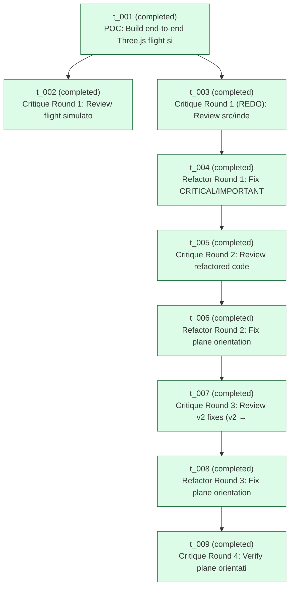

# Run `20260422_140431`

See also: [report.html](report.html)

| | |
|---|---|
| goal | Build a browser-only Three.js flight simulator demo under workspace/src/. Deliverables: index.html that loads Three.js from a CDN, plus whatever JS files you need. Features: a procedurally generated terrain (can be a heightmap or a simple hilly plane), a simple plane model (a box with wings is fine), WASD or arrow-key flight controls, third-person chase camera, sky/fog for atmosphere. This is a weekend demo — no build step, no bundler, no npm, no tests. Opening index.html in a browser must produce a flyable scene. Do NOT try to run it with Bash; browsers only. The critic will review the code statically. |
| team | `refactor-loop` |
| started | 2026-04-22T14:04:31.154925+00:00 |
| duration | 1270.0 s |
| status | **finalized** |
| total cost | $4.5651 (19 turns) |
| tokens | in 1093 / out 122444 / cache_r 6162693 |

## Timeline

_Tool-use tick marks are omitted in the markdown view — see [report.html](report.html) for the high-resolution timeline._

```mermaid
gantt
    title Dispatches by agent
    dateFormat X
    axisFormat %S s
    section lead
    turn :active, lead_0, 1776866673, 24s
    turn :active, lead_1, 1776866749, 10s
    turn :active, lead_2, 1776866933, 31s
    turn :active, lead_3, 1776867028, 18s
    turn :active, lead_4, 1776867210, 14s
    turn :active, lead_5, 1776867353, 19s
    turn :active, lead_6, 1776867573, 14s
    turn :active, lead_7, 1776867674, 20s
    turn :active, lead_8, 1776867814, 20s
    turn :active, lead_9, 1776867897, 43s
    section poc_dev
    task t_001 :done, poc_dev_0, 1776866697, 52s
    section critic
    task t_002 :done, critic_0, 1776866759, 174s
    task t_003 :done, critic_1, 1776866964, 64s
    task t_005 :done, critic_2, 1776867224, 129s
    task t_007 :done, critic_3, 1776867587, 87s
    task t_009 :done, critic_4, 1776867834, 63s
    section refactor_dev
    task t_004 :done, refactor_dev_0, 1776867046, 164s
    task t_006 :done, refactor_dev_1, 1776867372, 201s
    task t_008 :done, refactor_dev_2, 1776867694, 120s
```

## Task graph

## Per-agent costs

| agent | turns | cost | input | output | cache_r | cache_w |
|---|---:|---:|---:|---:|---:|---:|
| `critic` | 5 | $1.7036 | 227 | 53033 | 1675063 | 93760 |
| `lead` | 10 | $1.5352 | 396 | 16661 | 1443720 | 56915 |
| `poc_dev` | 1 | $0.0902 | 79 | 6390 | 226788 | 27849 |
| `refactor_dev` | 3 | $1.2360 | 391 | 46360 | 2817122 | 74562 |
| **TOTAL** | 19 | **$4.5651** | 1093 | 122444 | 6162693 | 253086 |

## Tool-use tally

| agent | Read | Bash | Write | create_task | assign_task | update_task | Glob | Edit | other |
|---|---:|---:|---:|---:|---:|---:|---:|---:|---:|
| `lead` | 12 | 0 | 0 | 9 | 9 | 0 | 4 | 0 | 3 |
| `poc_dev` | 5 | 3 | 1 | 0 | 0 | 1 | 0 | 0 | 0 |
| `critic` | 25 | 0 | 5 | 0 | 0 | 5 | 3 | 0 | 0 |
| `refactor_dev` | 17 | 21 | 9 | 0 | 0 | 3 | 0 | 6 | 0 |

## Artifacts

**critiques/**
- `critiques/critique_v1.md` (6,813 B)
- `critiques/critique_v1_redo.md` (10,055 B)
- `critiques/critique_v2.md` (7,393 B)
- `critiques/critique_v3.md` (7,132 B)
- `critiques/critique_v4.md` (5,588 B)
**root/**
- `DONE_CRITERIA.md` (2,095 B)
- `OUTPUT.md` (8,092 B)
- `refactor_notes_v1.md` (8,972 B)
- `refactor_notes_v2.md` (5,277 B)
- `refactor_notes_v3.md` (7,459 B)
**src/**
- `src/camera.js` (695 B)
- `src/config.js` (1,530 B)
- `src/controls.js` (4,377 B)
- `src/index.html` (5,532 B)
- `src/plane.js` (2,943 B)
- `src/terrain.js` (1,316 B)

## Messages

_No messages exchanged in this run._

## Event counts

| event | count |
|---|---:|
| `dispatch_end` | 9 |
| `dispatch_round` | 9 |
| `dispatch_start` | 9 |
| `lead_block` | 118 |
| `lead_prompt` | 10 |
| `lead_result` | 10 |
| `lead_turn_end` | 10 |
| `lead_turn_start` | 10 |
| `loop_exit` | 1 |
| `output_written` | 1 |
| `run_end` | 1 |
| `run_start` | 1 |
| `run_summary_written` | 1 |
| `teammate_block` | 281 |
| `teammate_prompt` | 9 |
| `teammate_result` | 9 |
| `tool_use` | 141 |
