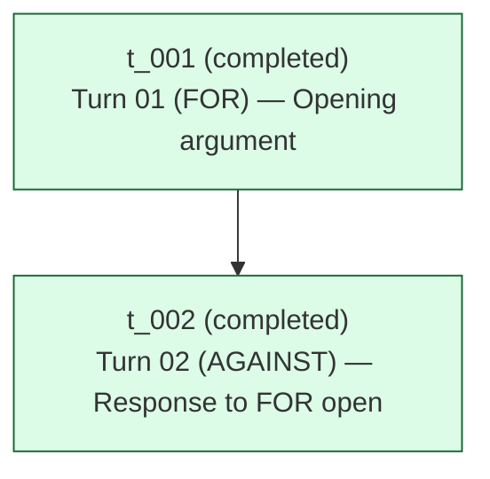

# Run `20260422_153924`

See also: [report.html](report.html)

| | |
|---|---|
| goal | Zero regulation on A.I. so we can get to ASI as soon as possible. |
| team | `steelman-debate` |
| started | 2026-04-22T15:39:24.209172+00:00 |
| duration | 178.9 s |
| status | **finalized** |
| total cost | $0.4218 (6 turns) |
| tokens | in 288 / out 17287 / cache_r 583968 |

## Timeline

_Tool-use tick marks are omitted in the markdown view — see [report.html](report.html) for the high-resolution timeline._

```mermaid
gantt
    title Dispatches by agent
    dateFormat X
    axisFormat %S s
    section lead
    turn :active, lead_0, 1776872366, 37s
    turn :active, lead_1, 1776872419, 22s
    turn :active, lead_2, 1776872500, 1s
    turn :active, lead_3, 1776872500, 37s
    section advocate_for
    task t_001 :done, advocate_for_0, 1776872403, 16s
    section advocate_against
    task t_002 :done, advocate_against_0, 1776872441, 59s
```

## Task graph

## Per-agent costs

| agent | turns | cost | input | output | cache_r | cache_w |
|---|---:|---:|---:|---:|---:|---:|
| `advocate_against` | 1 | $0.0661 | 58 | 7769 | 126441 | 11134 |
| `advocate_for` | 1 | $0.0303 | 30 | 1322 | 42493 | 15000 |
| `lead` | 4 | $0.3254 | 200 | 8196 | 415034 | 24592 |
| **TOTAL** | 6 | **$0.4218** | 288 | 17287 | 583968 | 50726 |

## Tool-use tally

| agent | Read | Glob | list_tasks | ScheduleWakeup | write_scratchpad | create_task | assign_task | Write | other |
|---|---:|---:|---:|---:|---:|---:|---:|---:|---:|
| `lead` | 3 | 3 | 3 | 3 | 2 | 2 | 2 | 0 | 2 |
| `advocate_for` | 1 | 0 | 0 | 0 | 0 | 0 | 0 | 1 | 1 |
| `advocate_against` | 7 | 1 | 0 | 0 | 0 | 0 | 0 | 1 | 1 |

## Artifacts

**debate/**
- `debate/turn_01_for.md` (564 B)
- `debate/turn_02_against.md` (579 B)
**root/**
- `DONE_CRITERIA.md` (1,038 B)
- `OUTPUT.md` (2,872 B)

## Messages

_No messages exchanged in this run._

## Event counts

| event | count |
|---|---:|
| `dispatch_end` | 2 |
| `dispatch_round` | 2 |
| `dispatch_start` | 2 |
| `lead_block` | 63 |
| `lead_prompt` | 4 |
| `lead_result` | 4 |
| `lead_turn_end` | 4 |
| `lead_turn_start` | 4 |
| `loop_exit` | 1 |
| `output_written` | 1 |
| `run_start` | 1 |
| `run_summary_written` | 1 |
| `teammate_block` | 28 |
| `teammate_prompt` | 2 |
| `teammate_result` | 2 |
| `tool_use` | 33 |
