# Run `20260422_160700_inlined`

See also: [report.html](report.html)

| | |
|---|---|
| goal | Zero regulation on A.I. so we can get to ASI as soon as possible. |
| team | `steelman-debate-inlined` |
| started | 2026-04-22T16:07:00.941304+00:00 |
| duration | 652.0 s |
| status | **finalized** |
| total cost | $2.6092 (21 turns) |
| tokens | in 604 / out 58136 / cache_r 1813591 |

## Timeline

_Tool-use tick marks are omitted in the markdown view — see [report.html](report.html) for the high-resolution timeline._

```mermaid
gantt
    title Dispatches by agent
    dateFormat X
    axisFormat %S s
    section lead
    turn :active, lead_0, 1776874022, 25s
    turn :active, lead_1, 1776874060, 17s
    turn :active, lead_2, 1776874096, 22s
    turn :active, lead_3, 1776874138, 21s
    turn :active, lead_4, 1776874188, 27s
    turn :active, lead_5, 1776874246, 31s
    turn :active, lead_6, 1776874318, 47s
    turn :active, lead_7, 1776874394, 32s
    turn :active, lead_8, 1776874459, 59s
    turn :active, lead_9, 1776874558, 39s
    turn :active, lead_10, 1776874631, 41s
    section advocate_for
    task t_001 :done, advocate_for_0, 1776874047, 13s
    task t_003 :done, advocate_for_1, 1776874118, 20s
    task t_005 :done, advocate_for_2, 1776874215, 31s
    task t_007 :done, advocate_for_3, 1776874365, 29s
    task t_009 :done, advocate_for_4, 1776874518, 40s
    section advocate_against
    task t_002 :done, advocate_against_0, 1776874077, 19s
    task t_004 :done, advocate_against_1, 1776874159, 29s
    task t_006 :done, advocate_against_2, 1776874277, 41s
    task t_008 :done, advocate_against_3, 1776874426, 33s
    task t_010 :done, advocate_against_4, 1776874597, 34s
```

## Task graph

```mermaid
graph TD
    t_001["t_001 (completed)<br/>Turn 01 (FOR)"]
    t_002["t_002 (completed)<br/>Turn 02 (AGAINST)"]
    t_003["t_003 (completed)<br/>Turn 03 (FOR)"]
    t_004["t_004 (completed)<br/>Turn 04 (AGAINST)"]
    t_005["t_005 (completed)<br/>Turn 05 (FOR)"]
    t_006["t_006 (completed)<br/>Turn 06 (AGAINST)"]
    t_007["t_007 (completed)<br/>Turn 07 (FOR)"]
    t_008["t_008 (completed)<br/>Turn 08 (AGAINST)"]
    t_009["t_009 (completed)<br/>Turn 09 (FOR)"]
    t_010["t_010 (completed)<br/>Turn 10 (AGAINST)"]
    classDef completed fill:#dcfce7,stroke:#166534;
    classDef failed fill:#fee2e2,stroke:#991b1b;
    classDef in_progress fill:#fef3c7,stroke:#92400e;
    classDef assigned fill:#e0e7ff,stroke:#3730a3;
    class t_001,t_002,t_003,t_004,t_005,t_006,t_007,t_008,t_009,t_010 completed;
```

## Per-agent costs

| agent | turns | cost | input | output | cache_r | cache_w |
|---|---:|---:|---:|---:|---:|---:|
| `advocate_against` | 5 | $0.4108 | 115 | 16787 | 307182 | 30095 |
| `advocate_for` | 5 | $0.3699 | 115 | 13571 | 267274 | 32446 |
| `lead` | 11 | $1.8284 | 374 | 27778 | 1239135 | 52832 |
| **TOTAL** | 21 | **$2.6092** | 604 | 58136 | 1813591 | 115373 |

## Tool-use tally

| agent | Read | create_task | assign_task | Write | update_task | write_scratchpad | finalize | other |
|---|---:|---:|---:|---:|---:|---:|---:|---:|
| `lead` | 11 | 10 | 10 | 0 | 0 | 1 | 1 | 0 |
| `advocate_for` | 0 | 0 | 0 | 5 | 5 | 0 | 0 | 0 |
| `advocate_against` | 0 | 0 | 0 | 5 | 5 | 0 | 0 | 0 |

## Artifacts

**debate/**
- `debate/turn_01_for.md` (746 B)
- `debate/turn_02_against.md` (729 B)
- `debate/turn_03_for.md` (748 B)
- `debate/turn_04_against.md` (847 B)
- `debate/turn_05_for.md` (748 B)
- `debate/turn_06_against.md` (684 B)
- `debate/turn_07_for.md` (770 B)
- `debate/turn_08_against.md` (755 B)
- `debate/turn_09_for.md` (683 B)
- `debate/turn_10_against.md` (765 B)
**root/**
- `DONE_CRITERIA.md` (1,570 B)
- `OUTPUT.md` (5,781 B)

## Messages

_No messages exchanged in this run._

## Event counts

| event | count |
|---|---:|
| `dispatch_end` | 10 |
| `dispatch_round` | 10 |
| `dispatch_start` | 10 |
| `lead_block` | 103 |
| `lead_prompt` | 11 |
| `lead_result` | 11 |
| `lead_turn_end` | 11 |
| `lead_turn_start` | 11 |
| `loop_exit` | 1 |
| `output_written` | 1 |
| `run_start` | 1 |
| `run_summary_written` | 1 |
| `teammate_block` | 62 |
| `teammate_prompt` | 10 |
| `teammate_result` | 10 |
| `tool_use` | 53 |
