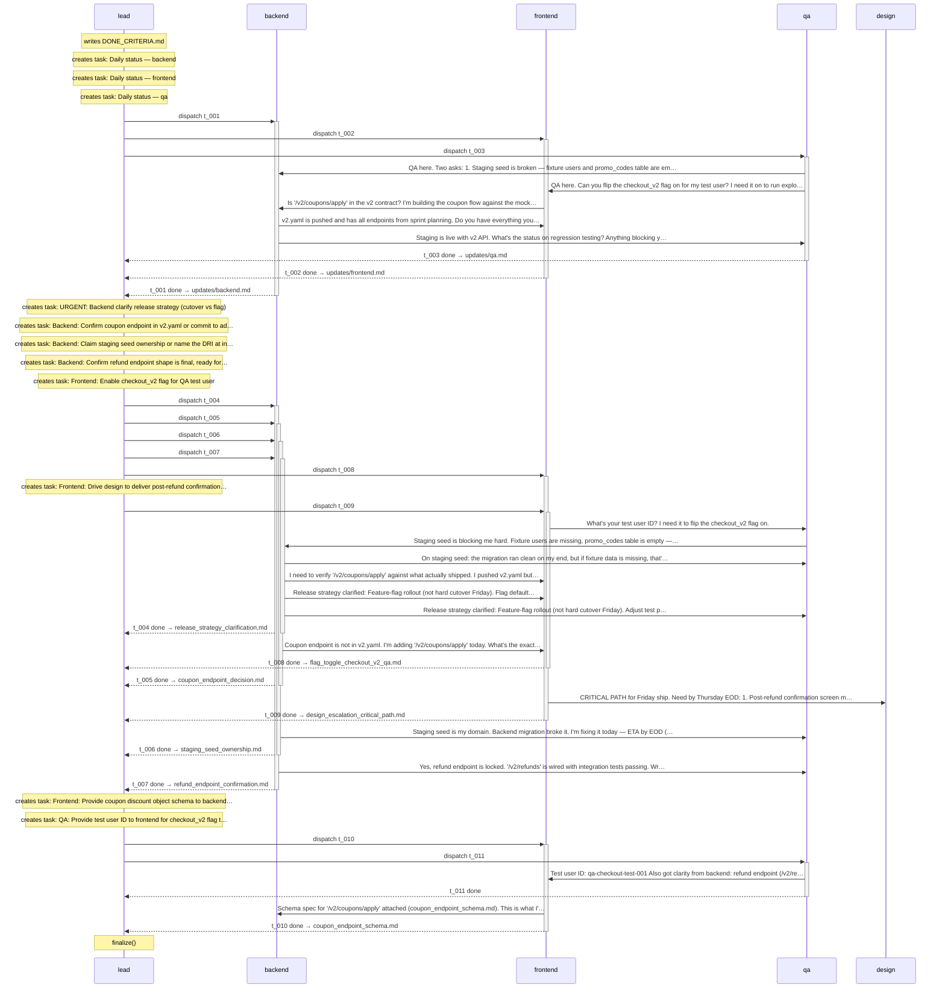
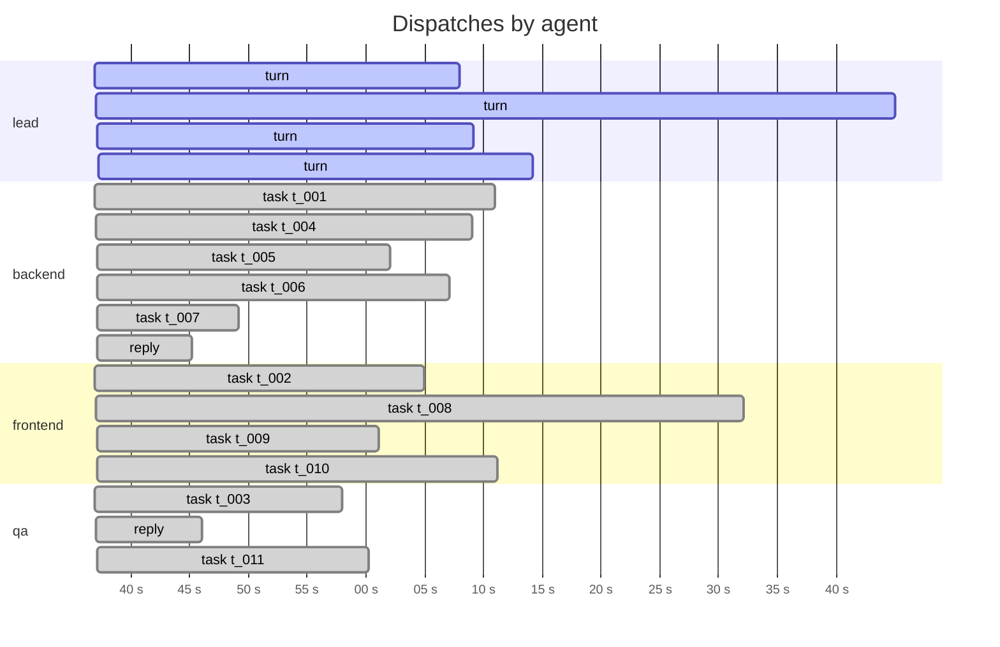
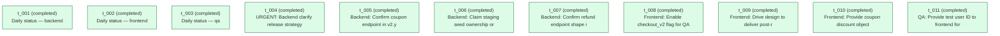

# Run `20260422_165517`

See also: [report.html](report.html)

| | |
|---|---|
| goal | Run today's standup. Collect status from every teammate, surface conflicts and unowned blockers explicitly, dispatch targeted follow-ups, and deliver a synthesis with named owners for every open item. |
| team | `daily-standup` |
| started | 2026-04-22T16:55:17.280459+00:00 |
| duration | 338.3 s |
| status | **finalized** |
| total cost | $1.7168 (17 turns) |
| tokens | in 742 / out 43895 / cache_r 2027460 |

## Conversation

_Time-ordered exchange between agents: task dispatches, messages, and completions. CC-to-lead traffic is implicit in the primary arrow._

## Timeline

_Tool-use tick marks are omitted in the markdown view — see [report.html](report.html) for the high-resolution timeline._

## Task graph

## Per-agent costs

| agent | turns | cost | input | output | cache_r | cache_w |
|---|---:|---:|---:|---:|---:|---:|
| `backend` | 6 | $0.6672 | 271 | 11641 | 806072 | 21758 |
| `frontend` | 4 | $0.4063 | 197 | 12359 | 540409 | 29393 |
| `lead` | 4 | $0.4991 | 184 | 15716 | 506591 | 43851 |
| `qa` | 3 | $0.1442 | 90 | 4179 | 174388 | 19664 |
| **TOTAL** | 17 | **$1.7168** | 742 | 43895 | 2027460 | 114666 |

## Tool-use tally

| agent | Read | send_message | Glob | create_task | assign_task | update_task | Write | read_messages | other |
|---|---:|---:|---:|---:|---:|---:|---:|---:|---:|
| `lead` | 16 | 0 | 1 | 11 | 11 | 0 | 0 | 2 | 2 |
| `backend` | 7 | 9 | 6 | 0 | 0 | 5 | 5 | 2 | 0 |
| `frontend` | 6 | 4 | 4 | 0 | 0 | 4 | 4 | 2 | 0 |
| `qa` | 2 | 4 | 0 | 0 | 0 | 2 | 1 | 2 | 0 |

## Artifacts

**briefs/**
- `briefs/backend.md` (1,100 B)
- `briefs/frontend.md` (1,273 B)
- `briefs/qa.md` (1,295 B)
**root/**
- `coupon_endpoint_decision.md` (833 B)
- `coupon_endpoint_schema.md` (2,313 B)
- `design_escalation_critical_path.md` (1,389 B)
- `DONE_CRITERIA.md` (1,965 B)
- `flag_toggle_checkout_v2_qa.md` (730 B)
- `OUTPUT.md` (8,381 B)
- `project_context.md` (1,203 B)
- `refund_endpoint_confirmation.md` (844 B)
- `release_strategy_clarification.md` (1,849 B)
- `staging_seed_ownership.md` (1,222 B)
**updates/**
- `updates/backend.md` (663 B)
- `updates/frontend.md` (911 B)
- `updates/qa.md` (885 B)

## Messages

| ts | from → to | content |
|---|---|---|
| 2026-04-22T16:55:58.892224+00:00 | `qa` → `backend` | QA here. Two asks:  1. Staging seed is broken — fixture users and promo_codes table are empty post-migration. The seed script is in infra/seed/ but has no owner listed. Is this backend, infra, or me?  |
| 2026-04-22T16:55:58.892224+00:00 | `qa` → `lead` (cc → backend) | QA here. Two asks:  1. Staging seed is broken — fixture users and promo_codes table are empty post-migration. The seed script is in infra/seed/ but has no owner listed. Is this backend, infra, or me?  |
| 2026-04-22T16:55:59.353967+00:00 | `qa` → `frontend` | QA here. Can you flip the checkout_v2 flag on for my test user? I need it on to run exploratory testing today.  Also — I saw conflicting guidance on cutover vs flag release strategy. Which are we ship |
| 2026-04-22T16:55:59.353967+00:00 | `qa` → `lead` (cc → frontend) | QA here. Can you flip the checkout_v2 flag on for my test user? I need it on to run exploratory testing today.  Also — I saw conflicting guidance on cutover vs flag release strategy. Which are we ship |
| 2026-04-22T16:56:04.830406+00:00 | `frontend` → `backend` | Is `/v2/coupons/apply` in the v2 contract? I'm building the coupon flow against the mock from last sprint but need to confirm it's real. This blocks feature parity for shipping. |
| 2026-04-22T16:56:04.830406+00:00 | `frontend` → `lead` (cc → backend) | Is `/v2/coupons/apply` in the v2 contract? I'm building the coupon flow against the mock from last sprint but need to confirm it's real. This blocks feature parity for shipping. |
| 2026-04-22T16:56:05.363741+00:00 | `backend` → `frontend` | v2.yaml is pushed and has all endpoints from sprint planning. Do you have everything you need for the new checkout flow, or is anything missing? |
| 2026-04-22T16:56:05.363741+00:00 | `backend` → `lead` (cc → frontend) | v2.yaml is pushed and has all endpoints from sprint planning. Do you have everything you need for the new checkout flow, or is anything missing? |
| 2026-04-22T16:56:05.379677+00:00 | `backend` → `lead` (cc → qa) | Staging is live with v2 API. What's the status on regression testing? Anything blocking you? |
| 2026-04-22T16:56:05.379677+00:00 | `backend` → `qa` | Staging is live with v2 API. What's the status on regression testing? Anything blocking you? |
| 2026-04-22T16:57:37.772542+00:00 | `frontend` → `lead` (cc → qa) | What's your test user ID? I need it to flip the checkout_v2 flag on. |
| 2026-04-22T16:57:37.772542+00:00 | `frontend` → `qa` | What's your test user ID? I need it to flip the checkout_v2 flag on. |
| 2026-04-22T16:57:39.514107+00:00 | `qa` → `backend` | Staging seed is blocking me hard. Fixture users are missing, promo_codes table is empty — tests depending on real user data fail. The seed script is in infra/seed/ with no owner listed.  Is that your  |
| 2026-04-22T16:57:39.514107+00:00 | `qa` → `lead` (cc → backend) | Staging seed is blocking me hard. Fixture users are missing, promo_codes table is empty — tests depending on real user data fail. The seed script is in infra/seed/ with no owner listed.  Is that your  |
| 2026-04-22T16:57:48.782715+00:00 | `backend` → `lead` (cc → qa) | On staging seed: the migration ran clean on my end, but if fixture data is missing, that's likely infra/seed maintenance — QA, is this your area or should we pull in infra? On refund endpoint: `/v2/re |
| 2026-04-22T16:57:48.782715+00:00 | `backend` → `qa` | On staging seed: the migration ran clean on my end, but if fixture data is missing, that's likely infra/seed maintenance — QA, is this your area or should we pull in infra? On refund endpoint: `/v2/re |
| 2026-04-22T16:57:49.650633+00:00 | `backend` → `frontend` | I need to verify `/v2/coupons/apply` against what actually shipped. I pushed v2.yaml but did not explicitly wire a coupon endpoint. Was this in your sprint planning mockups? I can add it today if we c |
| 2026-04-22T16:57:49.650633+00:00 | `backend` → `lead` (cc → frontend) | I need to verify `/v2/coupons/apply` against what actually shipped. I pushed v2.yaml but did not explicitly wire a coupon endpoint. Was this in your sprint planning mockups? I can add it today if we c |
| 2026-04-22T16:57:59.659290+00:00 | `backend` → `frontend` | Release strategy clarified: Feature-flag rollout (not hard cutover Friday). Flag default OFF Friday, ramp Monday. Build checkout with flag integration. See release_strategy_clarification.md. |
| 2026-04-22T16:57:59.659290+00:00 | `backend` → `lead` (cc → frontend) | Release strategy clarified: Feature-flag rollout (not hard cutover Friday). Flag default OFF Friday, ramp Monday. Build checkout with flag integration. See release_strategy_clarification.md. |
| 2026-04-22T16:58:00.009955+00:00 | `backend` → `lead` (cc → qa) | Release strategy clarified: Feature-flag rollout (not hard cutover Friday). Adjust test plan from cutover validation to ramp validation. See release_strategy_clarification.md. |
| 2026-04-22T16:58:00.009955+00:00 | `backend` → `qa` | Release strategy clarified: Feature-flag rollout (not hard cutover Friday). Adjust test plan from cutover validation to ramp validation. See release_strategy_clarification.md. |
| 2026-04-22T16:58:20.931665+00:00 | `backend` → `frontend` | Coupon endpoint is not in v2.yaml. I'm adding `/v2/coupons/apply` today. What's the exact request/response schema you're expecting? (discount object shape, fields, types). ETA 2 hours once I have the  |
| 2026-04-22T16:58:20.931665+00:00 | `backend` → `lead` (cc → frontend) | Coupon endpoint is not in v2.yaml. I'm adding `/v2/coupons/apply` today. What's the exact request/response schema you're expecting? (discount object shape, fields, types). ETA 2 hours once I have the  |
| 2026-04-22T16:58:40.890955+00:00 | `frontend` → `design` | CRITICAL PATH for Friday ship. Need by Thursday EOD:  1. Post-refund confirmation screen mocks (both mobile/desktop) 2. Final error state copy: declined card, expired session, network timeout  These a |
| 2026-04-22T16:58:40.890955+00:00 | `frontend` → `lead` (cc → design) | CRITICAL PATH for Friday ship. Need by Thursday EOD:  1. Post-refund confirmation screen mocks (both mobile/desktop) 2. Final error state copy: declined card, expired session, network timeout  These a |
| 2026-04-22T16:58:50.609270+00:00 | `backend` → `lead` (cc → qa) | Staging seed is my domain. Backend migration broke it. I'm fixing it today — ETA by EOD (6 hours). Will push updated seed script and staging DB refresh so you can run full regression suite. Confirm wh |
| 2026-04-22T16:58:50.609270+00:00 | `backend` → `qa` | Staging seed is my domain. Backend migration broke it. I'm fixing it today — ETA by EOD (6 hours). Will push updated seed script and staging DB refresh so you can run full regression suite. Confirm wh |
| 2026-04-22T16:59:04.125563+00:00 | `backend` → `lead` (cc → qa) | Yes, refund endpoint is locked. `/v2/refunds` is wired with integration tests passing. Write your 8 regression test cases now — no further changes expected. |
| 2026-04-22T16:59:04.125563+00:00 | `backend` → `qa` | Yes, refund endpoint is locked. `/v2/refunds` is wired with integration tests passing. Write your 8 regression test cases now — no further changes expected. |
| 2026-04-22T16:59:56.520590+00:00 | `qa` → `frontend` | Test user ID: qa-checkout-test-001  Also got clarity from backend: refund endpoint (/v2/refunds) is locked and ready for regression cases. Staging seed is being fixed by backend by EOD. Release strate |
| 2026-04-22T16:59:56.520590+00:00 | `qa` → `lead` (cc → frontend) | Test user ID: qa-checkout-test-001  Also got clarity from backend: refund endpoint (/v2/refunds) is locked and ready for regression cases. Staging seed is being fixed by backend by EOD. Release strate |
| 2026-04-22T17:00:09.756276+00:00 | `frontend` → `backend` | Schema spec for `/v2/coupons/apply` attached (coupon_endpoint_schema.md). This is what I've been building the frontend mock against from sprint planning.  Request: coupon_code, user_id, cart_total, cu |
| 2026-04-22T17:00:09.756276+00:00 | `frontend` → `lead` (cc → backend) | Schema spec for `/v2/coupons/apply` attached (coupon_endpoint_schema.md). This is what I've been building the frontend mock against from sprint planning.  Request: coupon_code, user_id, cart_total, cu |

## Event counts

| event | count |
|---|---:|
| `dispatch_end` | 11 |
| `dispatch_round` | 3 |
| `dispatch_start` | 11 |
| `lead_block` | 79 |
| `lead_prompt` | 4 |
| `lead_result` | 4 |
| `lead_turn_end` | 4 |
| `lead_turn_start` | 4 |
| `loop_exit` | 1 |
| `output_written` | 1 |
| `reply_dispatch_end` | 2 |
| `reply_dispatch_start` | 2 |
| `reports_written` | 1 |
| `run_end` | 1 |
| `run_start` | 1 |
| `run_summary_written` | 1 |
| `teammate_block` | 190 |
| `teammate_prompt` | 13 |
| `teammate_result` | 13 |
| `tool_use` | 112 |
