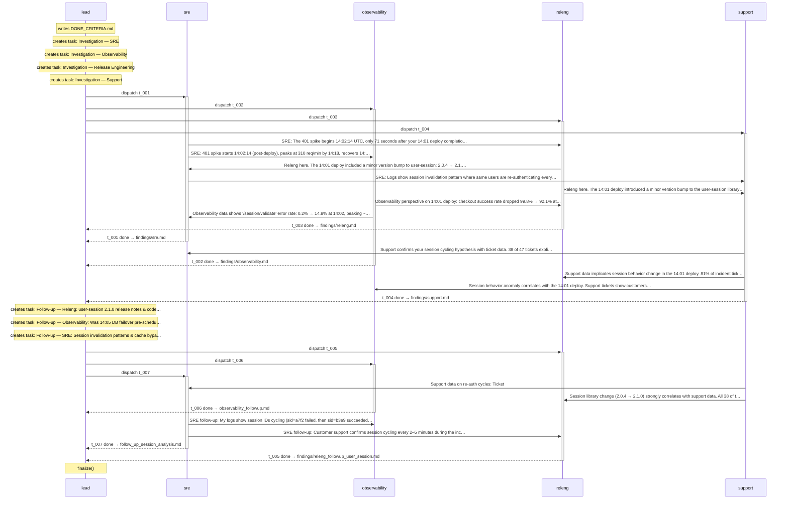
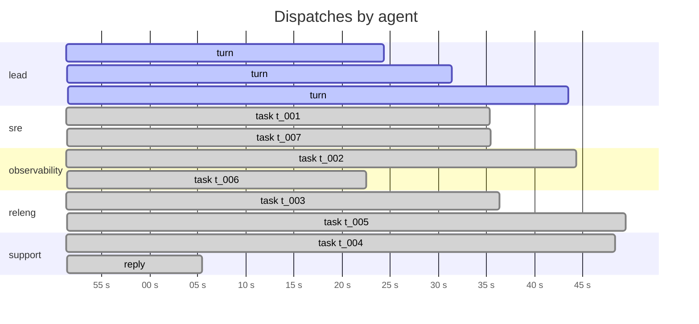
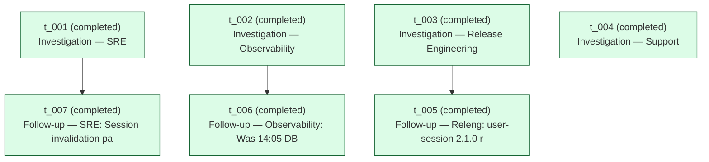

# Run `20260422_205531`

See also: [report.html](report.html)

| | |
|---|---|
| goal | Run the incident postmortem. Pool evidence from all four investigators, force cross-domain triangulation on contradictions and gaps, converge on a root-cause hypothesis supported by a specific join of evidence, and deliver remediation with named owners. |
| team | `incident-postmortem` |
| started | 2026-04-22T20:55:31.319946+00:00 |
| duration | 244.6 s |
| status | **finalized** |
| total cost | $0.8664 (11 turns) |
| tokens | in 564 / out 37991 / cache_r 1366917 |

## Conversation

_Time-ordered exchange between agents: task dispatches, messages, and completions. CC-to-lead traffic is implicit in the primary arrow._

## Timeline

_Tool-use tick marks are omitted in the markdown view — see [report.html](report.html) for the high-resolution timeline._

## Task graph

## Per-agent costs

| agent | turns | cost | input | output | cache_r | cache_w |
|---|---:|---:|---:|---:|---:|---:|
| `lead` | 3 | $0.3099 | 142 | 11376 | 385632 | 41978 |
| `observability` | 2 | $0.1285 | 81 | 6796 | 172010 | 21797 |
| `releng` | 2 | $0.1789 | 165 | 8503 | 440374 | 33655 |
| `sre` | 2 | $0.1296 | 95 | 6658 | 203708 | 23199 |
| `support` | 2 | $0.1194 | 81 | 4658 | 165193 | 21016 |
| **TOTAL** | 11 | **$0.8664** | 564 | 37991 | 1366917 | 141645 |

## Tool-use tally

| agent | Read | send_message | Glob | create_task | assign_task | Write | update_task | read_messages | other |
|---|---:|---:|---:|---:|---:|---:|---:|---:|---:|
| `lead` | 13 | 0 | 1 | 7 | 7 | 0 | 0 | 1 | 4 |
| `sre` | 5 | 5 | 1 | 0 | 0 | 2 | 2 | 1 | 0 |
| `observability` | 3 | 2 | 0 | 0 | 0 | 2 | 2 | 1 | 0 |
| `releng` | 11 | 2 | 8 | 0 | 0 | 2 | 2 | 1 | 0 |
| `support` | 5 | 5 | 1 | 0 | 0 | 1 | 1 | 1 | 0 |

## Artifacts

**briefs/**
- `briefs/observability.md` (2,230 B)
- `briefs/releng.md` (2,054 B)
- `briefs/sre.md` (2,018 B)
- `briefs/support.md` (2,512 B)
**findings/**
- `findings/observability.md` (3,243 B)
- `findings/releng.md` (2,500 B)
- `findings/releng_followup_user_session.md` (6,449 B)
- `findings/sre.md` (3,190 B)
- `findings/support.md` (3,238 B)
**root/**
- `DONE_CRITERIA.md` (3,390 B)
- `follow_up_session_analysis.md` (5,190 B)
- `observability_followup.md` (3,812 B)
- `OUTPUT.md` (8,847 B)
- `project_context.md` (1,613 B)

## Messages

| ts | from → to | content |
|---|---|---|
| 2026-04-22T20:56:30.964922+00:00 | `sre` → `lead` (cc → releng) | SRE: The 401 spike begins 14:02:14 UTC, only 71 seconds after your 14:01 deploy completion. The pattern shows sessions becoming valid → invalid → valid → invalid within 2–3 minute cycles, suggesting p |
| 2026-04-22T20:56:30.964922+00:00 | `sre` → `releng` | SRE: The 401 spike begins 14:02:14 UTC, only 71 seconds after your 14:01 deploy completion. The pattern shows sessions becoming valid → invalid → valid → invalid within 2–3 minute cycles, suggesting p |
| 2026-04-22T20:56:31.917854+00:00 | `sre` → `lead` (cc → observability) | SRE: 401 spike starts 14:02:14 (post-deploy), peaks at 310 req/min by 14:18, recovers 14:36 onward post-rollback. Questions: (1) Did the 14:05 scheduled DB failover trigger any immediate spike in sess |
| 2026-04-22T20:56:31.917854+00:00 | `sre` → `observability` | SRE: 401 spike starts 14:02:14 (post-deploy), peaks at 310 req/min by 14:18, recovers 14:36 onward post-rollback. Questions: (1) Did the 14:05 scheduled DB failover trigger any immediate spike in sess |
| 2026-04-22T20:56:32.775399+00:00 | `releng` → `lead` (cc → sre) | Releng here. The 14:01 deploy included a minor version bump to user-session: 2.0.4 → 2.1.0. The PR author incorrectly labeled it as patch-level. This library handles session management and could be di |
| 2026-04-22T20:56:32.775399+00:00 | `releng` → `sre` | Releng here. The 14:01 deploy included a minor version bump to user-session: 2.0.4 → 2.1.0. The PR author incorrectly labeled it as patch-level. This library handles session management and could be di |
| 2026-04-22T20:56:32.872030+00:00 | `sre` → `lead` (cc → support) | SRE: Logs show session invalidation pattern where same users are re-authenticating every 2–3 minutes (not normal session lifetime). During 14:02–14:35 UTC, do customer tickets show users complaining a |
| 2026-04-22T20:56:32.872030+00:00 | `sre` → `support` | SRE: Logs show session invalidation pattern where same users are re-authenticating every 2–3 minutes (not normal session lifetime). During 14:02–14:35 UTC, do customer tickets show users complaining a |
| 2026-04-22T20:56:35.271495+00:00 | `releng` → `lead` (cc → support) | Releng here. The 14:01 deploy introduced a minor version bump to the user-session library (2.0.4 → 2.1.0). Minor versions can carry behavior changes. Are you seeing customer reports of session-related |
| 2026-04-22T20:56:35.271495+00:00 | `releng` → `support` | Releng here. The 14:01 deploy introduced a minor version bump to the user-session library (2.0.4 → 2.1.0). Minor versions can carry behavior changes. Are you seeing customer reports of session-related |
| 2026-04-22T20:56:38.744876+00:00 | `observability` → `lead` (cc → releng) | Observability perspective on 14:01 deploy: checkout success rate dropped 99.8% → 92.1% at 14:02 UTC, with `/session/validate` errors spiking from 0.2% → 14.8% in same window. Session Redis cache-hit-r |
| 2026-04-22T20:56:38.744876+00:00 | `observability` → `releng` | Observability perspective on 14:01 deploy: checkout success rate dropped 99.8% → 92.1% at 14:02 UTC, with `/session/validate` errors spiking from 0.2% → 14.8% in same window. Session Redis cache-hit-r |
| 2026-04-22T20:56:40.022353+00:00 | `observability` → `lead` (cc → sre) | Observability data shows `/session/validate` error rate: 0.2% → 14.8% at 14:02, peaking ~18% around 14:20. Session Redis cache-hit-rate dropped 94.1% → 61.3% concurrently; Redis cluster itself healthy |
| 2026-04-22T20:56:40.022353+00:00 | `observability` → `sre` | Observability data shows `/session/validate` error rate: 0.2% → 14.8% at 14:02, peaking ~18% around 14:20. Session Redis cache-hit-rate dropped 94.1% → 61.3% concurrently; Redis cluster itself healthy |
| 2026-04-22T20:56:55.486751+00:00 | `support` → `lead` (cc → sre) | Support confirms your session cycling hypothesis with ticket data. 38 of 47 tickets explicitly report users logging in successfully, then being kicked out 2–5 minutes later, requiring re-login. Ticket |
| 2026-04-22T20:56:55.486751+00:00 | `support` → `sre` | Support confirms your session cycling hypothesis with ticket data. 38 of 47 tickets explicitly report users logging in successfully, then being kicked out 2–5 minutes later, requiring re-login. Ticket |
| 2026-04-22T20:56:57.018080+00:00 | `support` → `lead` (cc → releng) | Support data implicates session behavior change in the 14:01 deploy. 81% of incident tickets report the same pattern: successful login, then session expiration every 2–5 minutes, requiring multiple re |
| 2026-04-22T20:56:57.018080+00:00 | `support` → `releng` | Support data implicates session behavior change in the 14:01 deploy. 81% of incident tickets report the same pattern: successful login, then session expiration every 2–5 minutes, requiring multiple re |
| 2026-04-22T20:56:58.256370+00:00 | `support` → `lead` (cc → observability) | Session behavior anomaly correlates with the 14:01 deploy. Support tickets show customers experiencing session expiration every 2–5 minutes (abnormal vs normal multi-hour session lifetime). SRE observ |
| 2026-04-22T20:56:58.256370+00:00 | `support` → `observability` | Session behavior anomaly correlates with the 14:01 deploy. Support tickets show customers experiencing session expiration every 2–5 minutes (abnormal vs normal multi-hour session lifetime). SRE observ |
| 2026-04-22T20:57:53.625736+00:00 | `support` → `lead` (cc → sre) | Support data on re-auth cycles: Ticket #18431 explicitly states "Got logged out mid-checkout THREE times before it let me pay" — so at least one user persisted through 3 cycles. Ticket #18422 and #184 |
| 2026-04-22T20:57:53.625736+00:00 | `support` → `sre` | Support data on re-auth cycles: Ticket #18431 explicitly states "Got logged out mid-checkout THREE times before it let me pay" — so at least one user persisted through 3 cycles. Ticket #18422 and #184 |
| 2026-04-22T20:57:55.688081+00:00 | `support` → `lead` (cc → releng) | Session library change (2.0.4 → 2.1.0) strongly correlates with support data. All 38 of the primary incident tickets show the exact patterns you asked about: "had to re-login" (repeatedly), "session e |
| 2026-04-22T20:57:55.688081+00:00 | `support` → `releng` | Session library change (2.0.4 → 2.1.0) strongly correlates with support data. All 38 of the primary incident tickets show the exact patterns you asked about: "had to re-login" (repeatedly), "session e |
| 2026-04-22T20:58:19.145936+00:00 | `sre` → `lead` (cc → observability) | SRE follow-up: My logs show session IDs cycling (sid=a7f2 failed, then sid=b3e9 succeeded, then failed again), but I cannot correlate individual sessions to Redis cache keys or determine if the failur |
| 2026-04-22T20:58:19.145936+00:00 | `sre` → `observability` | SRE follow-up: My logs show session IDs cycling (sid=a7f2 failed, then sid=b3e9 succeeded, then failed again), but I cannot correlate individual sessions to Redis cache keys or determine if the failur |
| 2026-04-22T20:58:20.768890+00:00 | `sre` → `lead` (cc → releng) | SRE follow-up: Customer support confirms session cycling every 2–5 minutes during the incident, matching my logs exactly. This pattern screams "TTL changed downward" rather than validation logic broke |
| 2026-04-22T20:58:20.768890+00:00 | `sre` → `releng` | SRE follow-up: Customer support confirms session cycling every 2–5 minutes during the incident, matching my logs exactly. This pattern screams "TTL changed downward" rather than validation logic broke |

## Event counts

| event | count |
|---|---:|
| `dispatch_end` | 7 |
| `dispatch_round` | 2 |
| `dispatch_start` | 7 |
| `lead_block` | 59 |
| `lead_prompt` | 3 |
| `lead_result` | 3 |
| `lead_turn_end` | 3 |
| `lead_turn_start` | 3 |
| `loop_exit` | 1 |
| `output_written` | 1 |
| `reply_dispatch_end` | 1 |
| `reply_dispatch_start` | 1 |
| `reports_written` | 1 |
| `run_end` | 1 |
| `run_start` | 1 |
| `run_summary_written` | 1 |
| `teammate_block` | 167 |
| `teammate_prompt` | 8 |
| `teammate_result` | 8 |
| `tool_use` | 99 |
