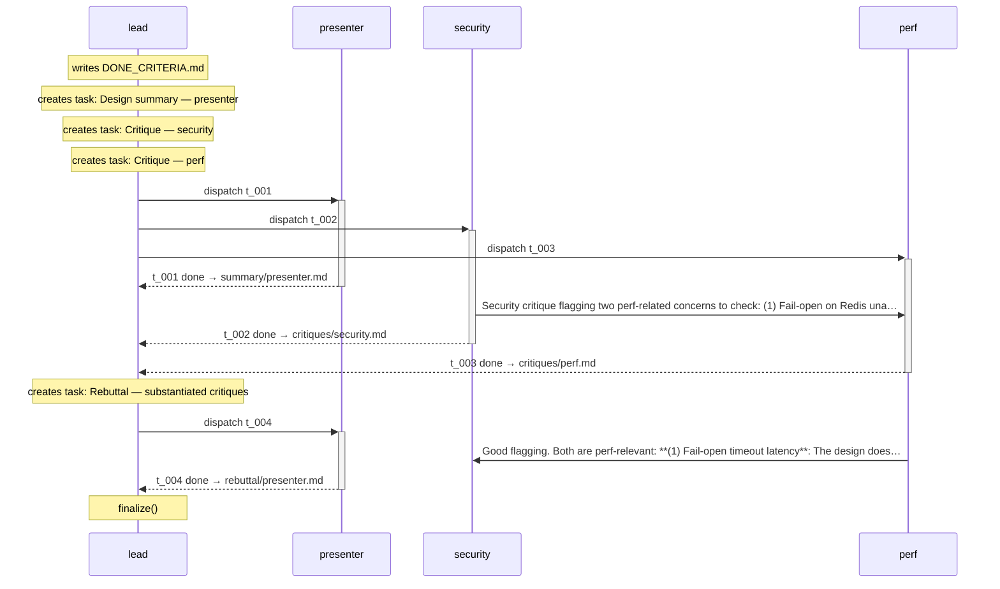
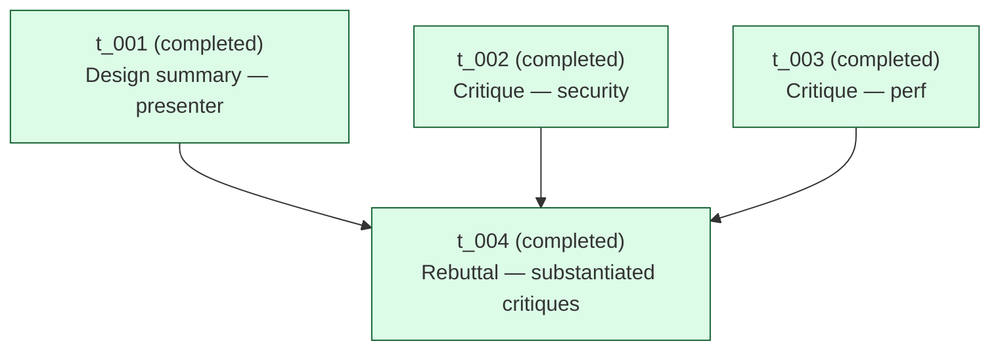

# Run `20260423_040452`

See also: [report.html](report.html)

| | |
|---|---|
| goal | Chair the design review. Get a faithful summary from the presenter, substantiated critiques from security and perf in parallel, force a rebuttal round on each substantiated critique, and issue a verdict (approve / revise / block) with concrete required revisions. |
| team | `design-review` |
| started | 2026-04-23T04:04:52.470626+00:00 |
| duration | 523.3 s |
| status | **finalized** |
| total cost | $0.7449 (8 turns) |
| tokens | in 355 / out 45045 / cache_r 900232 |

## Conversation

_Time-ordered exchange between agents: task dispatches, messages, and completions. CC-to-lead traffic is implicit in the primary arrow._

## Timeline

_Tool-use tick marks are omitted in the markdown view — see [report.html](report.html) for the high-resolution timeline._

```mermaid
gantt
    title Dispatches by agent
    dateFormat X
    axisFormat %S s
    section lead
    turn :active, lead_0, 1776917094, 40s
    turn :active, lead_1, 1776917355, 68s
    turn :active, lead_2, 1776917509, 105s
    section presenter
    task t_001 :done, presenter_0, 1776917134, 182s
    task t_004 :done, presenter_1, 1776917423, 86s
    section security
    task t_002 :done, security_0, 1776917134, 215s
    section perf
    task t_003 :done, perf_0, 1776917134, 220s
    reply :done, perf_1, 1776917423, 26s
```

## Task graph

## Per-agent costs

| agent | turns | cost | input | output | cache_r | cache_w |
|---|---:|---:|---:|---:|---:|---:|
| `lead` | 3 | $0.3030 | 142 | 11552 | 365302 | 35025 |
| `perf` | 2 | $0.2572 | 74 | 17106 | 223903 | 23382 |
| `presenter` | 2 | $0.1221 | 81 | 9510 | 187603 | 15813 |
| `security` | 1 | $0.0626 | 58 | 6877 | 123424 | 12148 |
| **TOTAL** | 8 | **$0.7449** | 355 | 45045 | 900232 | 86368 |

## Tool-use tally

| agent | Read | Glob | create_task | assign_task | Write | update_task | list_tasks | read_messages | other |
|---|---:|---:|---:|---:|---:|---:|---:|---:|---:|
| `lead` | 13 | 1 | 4 | 4 | 0 | 0 | 2 | 1 | 2 |
| `presenter` | 6 | 1 | 0 | 0 | 2 | 2 | 0 | 0 | 0 |
| `security` | 9 | 1 | 0 | 0 | 1 | 1 | 0 | 0 | 1 |
| `perf` | 9 | 1 | 0 | 0 | 1 | 1 | 0 | 1 | 1 |

## Artifacts

**briefs/**
- `briefs/design_doc.md` (2,930 B)
- `briefs/perf.md` (2,225 B)
- `briefs/security.md` (1,753 B)
**critiques/**
- `critiques/perf.md` (2,003 B)
- `critiques/security.md` (5,613 B)
**rebuttal/**
- `rebuttal/presenter.md` (4,620 B)
**root/**
- `DONE_CRITERIA.md` (3,264 B)
- `OUTPUT.md` (8,404 B)
- `project_context.md` (1,227 B)
**summary/**
- `summary/presenter.md` (2,475 B)

## Messages

| ts | from → to | content |
|---|---|---|
| 2026-04-23T04:08:36.112477+00:00 | `security` → `lead` (cc → perf) | Security critique flagging two perf-related concerns to check: (1) Fail-open on Redis unavailability — what is the latency impact if the sidecar times out waiting for Redis before falling back to allo |
| 2026-04-23T04:08:36.112477+00:00 | `security` → `perf` | Security critique flagging two perf-related concerns to check: (1) Fail-open on Redis unavailability — what is the latency impact if the sidecar times out waiting for Redis before falling back to allo |
| 2026-04-23T04:10:39.864978+00:00 | `perf` → `lead` (cc → security) | Good flagging. Both are perf-relevant:  **(1) Fail-open timeout latency**: The design doesn't specify the Redis read timeout. If the sidecar is configured with a short timeout (e.g., 10ms) to avoid bl |
| 2026-04-23T04:10:39.864978+00:00 | `perf` → `security` | Good flagging. Both are perf-relevant:  **(1) Fail-open timeout latency**: The design doesn't specify the Redis read timeout. If the sidecar is configured with a short timeout (e.g., 10ms) to avoid bl |

## Event counts

| event | count |
|---|---:|
| `dispatch_end` | 4 |
| `dispatch_round` | 2 |
| `dispatch_start` | 4 |
| `lead_block` | 56 |
| `lead_prompt` | 3 |
| `lead_result` | 3 |
| `lead_turn_end` | 3 |
| `lead_turn_start` | 3 |
| `loop_exit` | 1 |
| `output_written` | 1 |
| `reply_dispatch_end` | 1 |
| `reply_dispatch_start` | 1 |
| `run_start` | 1 |
| `run_summary_written` | 1 |
| `teammate_block` | 89 |
| `teammate_prompt` | 5 |
| `teammate_result` | 5 |
| `tool_use` | 65 |
