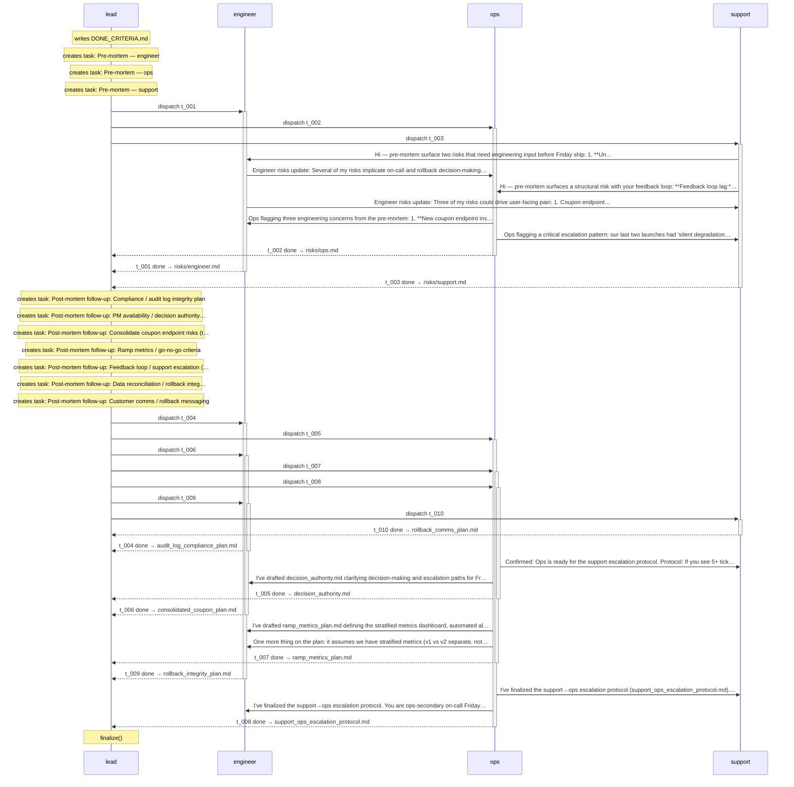
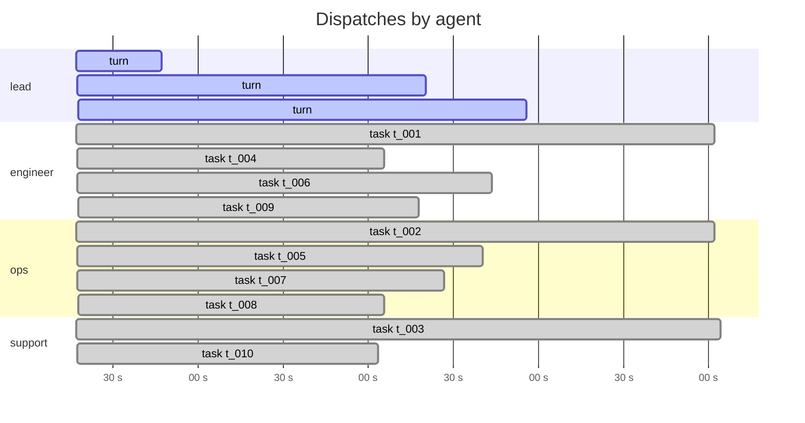
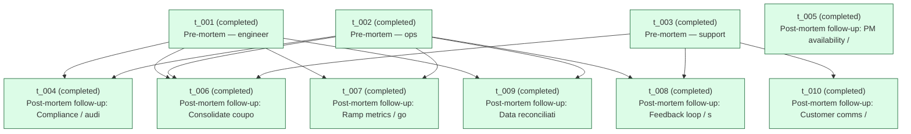

# Run `20260423_040453`

See also: [report.html](report.html)

| | |
|---|---|
| goal | Run the pre-mortem. Collect failure modes from each role in parallel, cluster duplicates, force exploration of risk-class gaps nobody raised, rebalance loud-but-improbable risks against quieter high-impact ones, and deliver a prioritized mitigation list with owners. |
| team | `launch-premortem` |
| started | 2026-04-23T04:04:53.991207+00:00 |
| duration | 921.3 s |
| status | **finalized** |
| total cost | $2.0448 (13 turns) |
| tokens | in 4088 / out 103589 / cache_r 1749159 |

## Conversation

_Time-ordered exchange between agents: task dispatches, messages, and completions. CC-to-lead traffic is implicit in the primary arrow._

## Timeline

_Tool-use tick marks are omitted in the markdown view — see [report.html](report.html) for the high-resolution timeline._

## Task graph

## Per-agent costs

| agent | turns | cost | input | output | cache_r | cache_w |
|---|---:|---:|---:|---:|---:|---:|
| `engineer` | 4 | $0.7371 | 155 | 36446 | 582794 | 60435 |
| `lead` | 3 | $0.4331 | 3683 | 25137 | 330508 | 105068 |
| `ops` | 4 | $0.6715 | 169 | 28780 | 637188 | 49667 |
| `support` | 2 | $0.2032 | 81 | 13226 | 198669 | 28473 |
| **TOTAL** | 13 | **$2.0448** | 4088 | 103589 | 1749159 | 243643 |

## Tool-use tally

| agent | Read | send_message | create_task | assign_task | Write | update_task | Glob | read_messages | other |
|---|---:|---:|---:|---:|---:|---:|---:|---:|---:|
| `lead` | 12 | 0 | 10 | 10 | 0 | 0 | 1 | 1 | 2 |
| `engineer` | 9 | 2 | 0 | 0 | 4 | 4 | 2 | 1 | 0 |
| `ops` | 8 | 8 | 0 | 0 | 4 | 4 | 3 | 1 | 0 |
| `support` | 5 | 2 | 0 | 0 | 2 | 2 | 1 | 1 | 0 |

## Artifacts

**briefs/**
- `briefs/engineer.md` (2,367 B)
- `briefs/ops.md` (2,431 B)
- `briefs/support.md` (2,421 B)
**risks/**
- `risks/engineer.md` (6,947 B)
- `risks/ops.md` (7,291 B)
- `risks/support.md` (9,301 B)
**root/**
- `audit_log_compliance_plan.md` (15,457 B)
- `consolidated_coupon_plan.md` (28,215 B)
- `decision_authority.md` (8,810 B)
- `DONE_CRITERIA.md` (2,059 B)
- `OUTPUT.md` (29,100 B)
- `project_context.md` (1,858 B)
- `ramp_metrics_plan.md` (17,885 B)
- `rollback_comms_plan.md` (11,764 B)
- `rollback_integrity_plan.md` (31,614 B)
- `support_ops_escalation_protocol.md` (17,794 B)

## Messages

| ts | from → to | content |
|---|---|---|
| 2026-04-23T04:08:34.889229+00:00 | `support` → `engineer` | Hi — pre-mortem surface two risks that need engineering input before Friday ship:  1. **Unbriefed coupon endpoint:** The `/v2/coupons/apply` endpoint is new this week, untested, and support has had ze |
| 2026-04-23T04:08:34.889229+00:00 | `support` → `lead` (cc → engineer) | Hi — pre-mortem surface two risks that need engineering input before Friday ship:  1. **Unbriefed coupon endpoint:** The `/v2/coupons/apply` endpoint is new this week, untested, and support has had ze |
| 2026-04-23T04:08:36.245598+00:00 | `engineer` → `lead` (cc → ops) | Engineer risks update:  Several of my risks implicate on-call and rollback decision-making:  1. Redis session latency spike during Monday ramp (med/high likelihood, high impact) — single-node Redis un |
| 2026-04-23T04:08:36.245598+00:00 | `engineer` → `ops` | Engineer risks update:  Several of my risks implicate on-call and rollback decision-making:  1. Redis session latency spike during Monday ramp (med/high likelihood, high impact) — single-node Redis un |
| 2026-04-23T04:08:37.249924+00:00 | `support` → `lead` (cc → ops) | Hi — pre-mortem surfaces a structural risk with your feedback loop:  **Feedback loop lag:** Historical pattern from past launches: tickets are the first signal of bugs. If the new coupon endpoint fail |
| 2026-04-23T04:08:37.249924+00:00 | `support` → `ops` | Hi — pre-mortem surfaces a structural risk with your feedback loop:  **Feedback loop lag:** Historical pattern from past launches: tickets are the first signal of bugs. If the new coupon endpoint fail |
| 2026-04-23T04:08:38.357981+00:00 | `engineer` → `lead` (cc → support) | Engineer risks update:  Three of my risks could drive user-facing pain:  1. Coupon endpoint schema mismatch (med/high likelihood, high impact) — real production coupon codes/carts may fail in the new  |
| 2026-04-23T04:08:38.357981+00:00 | `engineer` → `support` | Engineer risks update:  Three of my risks could drive user-facing pain:  1. Coupon endpoint schema mismatch (med/high likelihood, high impact) — real production coupon codes/carts may fail in the new  |
| 2026-04-23T04:08:39.649958+00:00 | `ops` → `engineer` | Ops flagging three engineering concerns from the pre-mortem:  1. **New coupon endpoint instrumentation**: `/v2/coupons/apply` was added this week. It needs to be stress-tested before Friday and have t |
| 2026-04-23T04:08:39.649958+00:00 | `ops` → `lead` (cc → engineer) | Ops flagging three engineering concerns from the pre-mortem:  1. **New coupon endpoint instrumentation**: `/v2/coupons/apply` was added this week. It needs to be stress-tested before Friday and have t |
| 2026-04-23T04:08:41.791417+00:00 | `ops` → `lead` (cc → support) | Ops flagging a critical escalation pattern: our last two launches had "silent degradation" — no ops alerts fired, but customers noticed. The first signal was always a support-ticket volume spike 20–60 |
| 2026-04-23T04:08:41.791417+00:00 | `ops` → `support` | Ops flagging a critical escalation pattern: our last two launches had "silent degradation" — no ops alerts fired, but customers noticed. The first signal was always a support-ticket volume spike 20–60 |
| 2026-04-23T04:12:58.369836+00:00 | `ops` → `lead` (cc → support) | Confirmed: Ops is ready for the support escalation protocol.  Protocol: If you see 5+ tickets in 1 hour with the same symptom/keyword (e.g., "coupon didn't apply," "session expired," "payment declined |
| 2026-04-23T04:12:58.369836+00:00 | `ops` → `support` | Confirmed: Ops is ready for the support escalation protocol.  Protocol: If you see 5+ tickets in 1 hour with the same symptom/keyword (e.g., "coupon didn't apply," "session expired," "payment declined |
| 2026-04-23T04:13:00.854708+00:00 | `ops` → `engineer` | I've drafted decision_authority.md clarifying decision-making and escalation paths for Friday ship through Monday ramp conclusion.  Key ops-to-eng moments: - If error rate/latency degrades during ramp |
| 2026-04-23T04:13:00.854708+00:00 | `ops` → `lead` (cc → engineer) | I've drafted decision_authority.md clarifying decision-making and escalation paths for Friday ship through Monday ramp conclusion.  Key ops-to-eng moments: - If error rate/latency degrades during ramp |
| 2026-04-23T04:15:33.378288+00:00 | `ops` → `engineer` | I've drafted ramp_metrics_plan.md defining the stratified metrics dashboard, automated alerts, and go/no-go criteria for each ramp stage.  Critical asks for you: 1. **Dashboard (7 panels):** Datadog d |
| 2026-04-23T04:15:33.378288+00:00 | `ops` → `lead` (cc → engineer) | I've drafted ramp_metrics_plan.md defining the stratified metrics dashboard, automated alerts, and go/no-go criteria for each ramp stage.  Critical asks for you: 1. **Dashboard (7 panels):** Datadog d |
| 2026-04-23T04:15:35.286810+00:00 | `ops` → `engineer` | One more thing on the plan: it assumes we have stratified metrics (v1 vs v2 separate, not blended). If your current instrumentation only reports blended metrics, we'll need to either: - Add feature-fl |
| 2026-04-23T04:15:35.286810+00:00 | `ops` → `lead` (cc → engineer) | One more thing on the plan: it assumes we have stratified metrics (v1 vs v2 separate, not blended). If your current instrumentation only reports blended metrics, we'll need to either: - Add feature-fl |
| 2026-04-23T04:17:20.408555+00:00 | `ops` → `lead` (cc → support) | I've finalized the support→ops escalation protocol (support_ops_escalation_protocol.md).  **Friday morning briefing (REQUIRED):** - Time: Friday 2026-04-24 at 14:00 UTC (2 hours before ship) - Duratio |
| 2026-04-23T04:17:20.408555+00:00 | `ops` → `support` | I've finalized the support→ops escalation protocol (support_ops_escalation_protocol.md).  **Friday morning briefing (REQUIRED):** - Time: Friday 2026-04-24 at 14:00 UTC (2 hours before ship) - Duratio |
| 2026-04-23T04:17:23.433993+00:00 | `ops` → `engineer` | I've finalized the support→ops escalation protocol. You are ops-secondary on-call Friday evening through Sunday.  **Key responsibility:** If support escalates a [PATTERN] message to #ops-escalation an |
| 2026-04-23T04:17:23.433993+00:00 | `ops` → `lead` (cc → engineer) | I've finalized the support→ops escalation protocol. You are ops-secondary on-call Friday evening through Sunday.  **Key responsibility:** If support escalates a [PATTERN] message to #ops-escalation an |

## Event counts

| event | count |
|---|---:|
| `dispatch_end` | 10 |
| `dispatch_round` | 2 |
| `dispatch_start` | 10 |
| `lead_block` | 62 |
| `lead_prompt` | 3 |
| `lead_result` | 3 |
| `lead_turn_end` | 3 |
| `lead_turn_start` | 3 |
| `loop_exit` | 1 |
| `output_written` | 1 |
| `run_start` | 1 |
| `run_summary_written` | 1 |
| `teammate_block` | 163 |
| `teammate_prompt` | 10 |
| `teammate_result` | 10 |
| `tool_use` | 99 |
