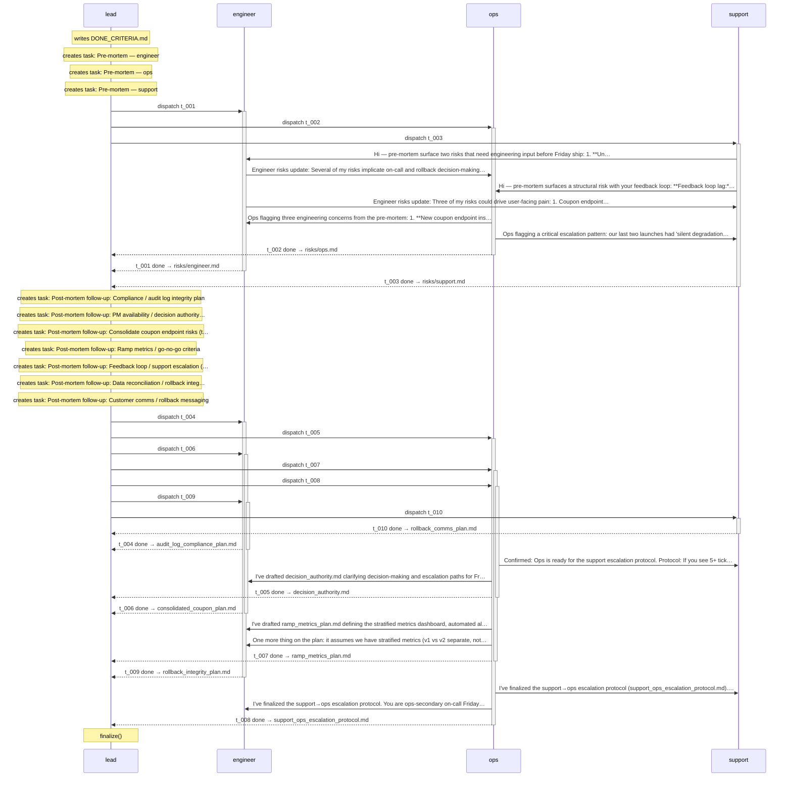

## Conversation

_Time-ordered exchange between agents: task dispatches, messages, and completions. CC-to-lead traffic is implicit in the primary arrow._

```mermaid
sequenceDiagram
    participant lead
    participant engineer
    participant ops
    participant support
    Note over lead: writes DONE_CRITERIA.md
    Note over lead: creates task: Pre-mortem — engineer
    Note over lead: creates task: Pre-mortem — ops
    Note over lead: creates task: Pre-mortem — support
    lead->>+engineer: dispatch t_001
    lead->>+ops: dispatch t_002
    lead->>+support: dispatch t_003
    support->>engineer: Hi — pre-mortem surface two risks that need engineering input before Friday ship: 1. **Un…
    engineer->>ops: Engineer risks update: Several of my risks implicate on-call and rollback decision-making…
    support->>ops: Hi — pre-mortem surfaces a structural risk with your feedback loop: **Feedback loop lag:*…
    engineer->>support: Engineer risks update: Three of my risks could drive user-facing pain: 1. Coupon endpoint…
    ops->>engineer: Ops flagging three engineering concerns from the pre-mortem: 1. **New coupon endpoint ins…
    ops->>support: Ops flagging a critical escalation pattern: our last two launches had 'silent degradation…
    ops-->>-lead: t_002 done → risks/ops.md
    engineer-->>-lead: t_001 done → risks/engineer.md
    support-->>-lead: t_003 done → risks/support.md
    Note over lead: creates task: Post-mortem follow-up: Compliance / audit log integrity plan
    Note over lead: creates task: Post-mortem follow-up: PM availability / decision authority…
    Note over lead: creates task: Post-mortem follow-up: Consolidate coupon endpoint risks (t…
    Note over lead: creates task: Post-mortem follow-up: Ramp metrics / go-no-go criteria
    Note over lead: creates task: Post-mortem follow-up: Feedback loop / support escalation (…
    Note over lead: creates task: Post-mortem follow-up: Data reconciliation / rollback integ…
    Note over lead: creates task: Post-mortem follow-up: Customer comms / rollback messaging
    lead->>+engineer: dispatch t_004
    lead->>+ops: dispatch t_005
    lead->>+engineer: dispatch t_006
    lead->>+ops: dispatch t_007
    lead->>+ops: dispatch t_008
    lead->>+engineer: dispatch t_009
    lead->>+support: dispatch t_010
    support-->>-lead: t_010 done → rollback_comms_plan.md
    engineer-->>-lead: t_004 done → audit_log_compliance_plan.md
    ops->>support: Confirmed: Ops is ready for the support escalation protocol. Protocol: If you see 5+ tick…
    ops->>engineer: I've drafted decision_authority.md clarifying decision-making and escalation paths for Fr…
    ops-->>-lead: t_005 done → decision_authority.md
    engineer-->>-lead: t_006 done → consolidated_coupon_plan.md
    ops->>engineer: I've drafted ramp_metrics_plan.md defining the stratified metrics dashboard, automated al…
    ops->>engineer: One more thing on the plan: it assumes we have stratified metrics (v1 vs v2 separate, not…
    ops-->>-lead: t_007 done → ramp_metrics_plan.md
    engineer-->>-lead: t_009 done → rollback_integrity_plan.md
    ops->>support: I've finalized the support→ops escalation protocol (support_ops_escalation_protocol.md).…
    ops->>engineer: I've finalized the support→ops escalation protocol. You are ops-secondary on-call Friday…
    ops-->>-lead: t_008 done → support_ops_escalation_protocol.md
    Note over lead: finalize()
```
