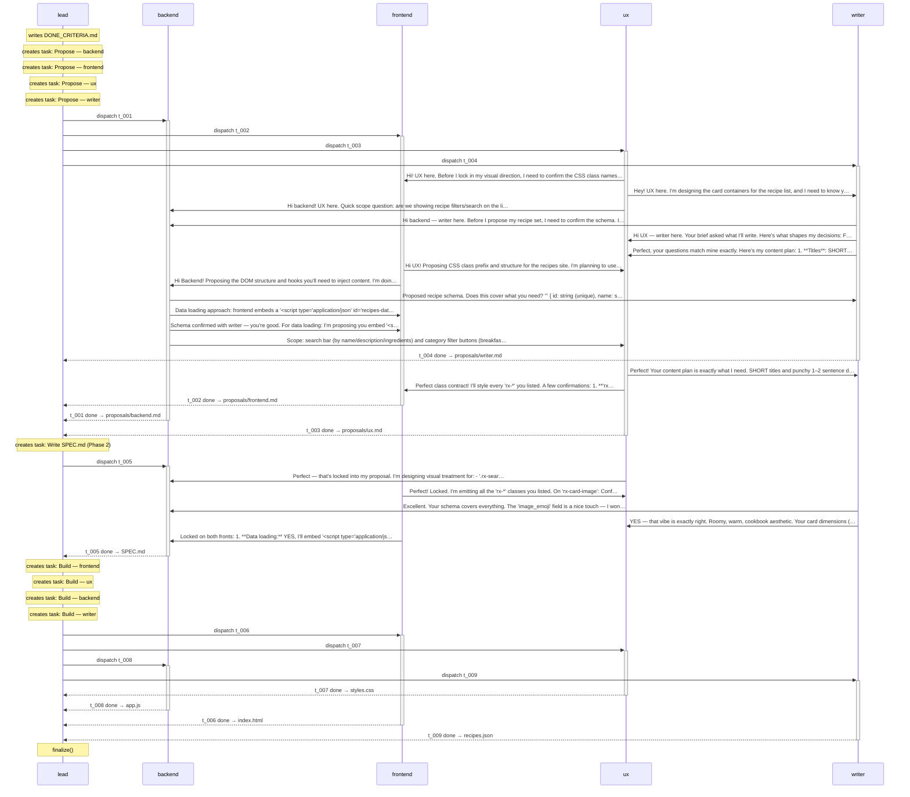
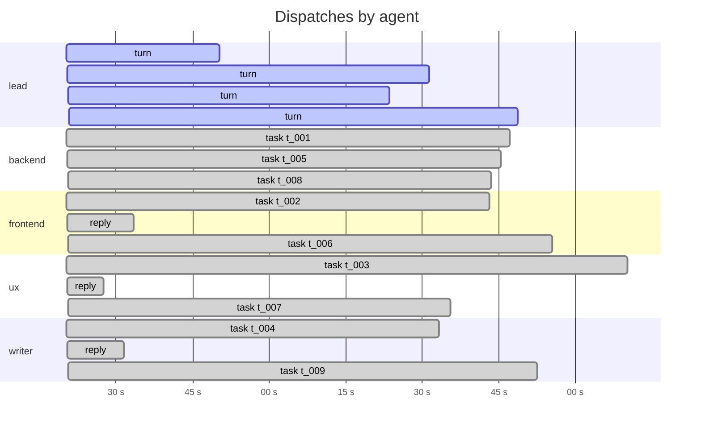
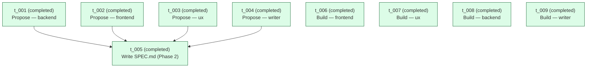

# Run `20260423_045647`

See also: [report.html](report.html)

| | |
|---|---|
| goal | Ship a recipes website. Take the vague brief through two rounds of team deliberation, produce a SPEC.md that pins every cross-team contract, then dispatch parallel build tasks with no further coordination. Verify the produced files form a working static site. |
| team | `recipes-website` |
| started | 2026-04-23T04:56:47.528362+00:00 |
| duration | 547.7 s |
| status | **finalized** |
| total cost | $2.0159 (16 turns) |
| tokens | in 668 / out 85685 / cache_r 2071353 |


## Conversation

_Time-ordered exchange between agents: task dispatches, messages, and completions. CC-to-lead traffic is implicit in the primary arrow._



## Timeline

_Tool-use tick marks are omitted in the markdown view — see [report.html](report.html) for the high-resolution timeline._



## Task graph



## Per-agent costs

| agent | turns | cost | input | output | cache_r | cache_w |
|---|---:|---:|---:|---:|---:|---:|
| `backend` | 3 | $0.4228 | 132 | 20835 | 437378 | 47174 |
| `frontend` | 3 | $0.2893 | 118 | 12833 | 327367 | 38131 |
| `lead` | 4 | $0.6620 | 154 | 26405 | 584837 | 78087 |
| `ux` | 3 | $0.3685 | 139 | 14645 | 403543 | 34823 |
| `writer` | 3 | $0.2733 | 125 | 10967 | 318228 | 30657 |
| **TOTAL** | 16 | **$2.0159** | 668 | 85685 | 2071353 | 228872 |

## Tool-use tally

| agent | Read | send_message | read_messages | Write | create_task | assign_task | update_task | Glob | other |
|---|---:|---:|---:|---:|---:|---:|---:|---:|---:|
| `lead` | 19 | 0 | 1 | 0 | 9 | 9 | 0 | 1 | 2 |
| `backend` | 10 | 4 | 3 | 3 | 0 | 0 | 3 | 1 | 0 |
| `frontend` | 9 | 4 | 1 | 2 | 0 | 0 | 2 | 3 | 0 |
| `ux` | 6 | 6 | 4 | 3 | 0 | 0 | 2 | 1 | 0 |
| `writer` | 8 | 5 | 3 | 2 | 0 | 0 | 2 | 1 | 0 |

## Artifacts

**briefs/**
- `briefs/backend.md` (1,913 B)
- `briefs/frontend.md` (1,900 B)
- `briefs/ux.md` (1,689 B)
- `briefs/writer.md` (1,772 B)
**proposals/**
- `proposals/backend.md` (4,492 B)
- `proposals/frontend.md` (5,882 B)
- `proposals/ux.md` (7,425 B)
- `proposals/writer.md` (2,977 B)
**root/**
- `app.js` (7,152 B)
- `DONE_CRITERIA.md` (1,667 B)
- `index.html` (12,682 B)
- `OUTPUT.md` (5,928 B)
- `project_context.md` (1,929 B)
- `recipes.json` (9,850 B)
- `SPEC.md` (17,843 B)
- `styles.css` (9,400 B)

## Messages

| ts | from → to | content |
|---|---|---|
| 2026-04-23T04:57:46.275899+00:00 | `ux` → `frontend` | Hi! UX here. Before I lock in my visual direction, I need to confirm the CSS class names you're committing to emit. I'm planning a warm, editorial card-based layout for the recipe list.   Please give  |
| 2026-04-23T04:57:46.275899+00:00 | `ux` → `lead` (cc → frontend) | Hi! UX here. Before I lock in my visual direction, I need to confirm the CSS class names you're committing to emit. I'm planning a warm, editorial card-based layout for the recipe list.   Please give  |
| 2026-04-23T04:57:48.003632+00:00 | `ux` → `lead` (cc → writer) | Hey! UX here. I'm designing the card containers for the recipe list, and I need to know your content density:  1. Recipe titles — a few words (e.g., "Rustic Bread") or longer (e.g., "Rustic Sourdough  |
| 2026-04-23T04:57:48.003632+00:00 | `ux` → `writer` | Hey! UX here. I'm designing the card containers for the recipe list, and I need to know your content density:  1. Recipe titles — a few words (e.g., "Rustic Bread") or longer (e.g., "Rustic Sourdough  |
| 2026-04-23T04:57:48.796874+00:00 | `ux` → `backend` | Hi backend! UX here. Quick scope question: are we showing recipe filters/search on the list view, or is it a straight grid of all recipes?  This affects the overall layout complexity and whether I nee |
| 2026-04-23T04:57:48.796874+00:00 | `ux` → `lead` (cc → backend) | Hi backend! UX here. Quick scope question: are we showing recipe filters/search on the list view, or is it a straight grid of all recipes?  This affects the overall layout complexity and whether I nee |
| 2026-04-23T04:57:51.642165+00:00 | `writer` → `backend` | Hi backend — writer here. Before I propose my recipe set, I need to confirm the schema. I'm planning 8 recipes with these fields per recipe:  REQUIRED: - name (string) - category (string — one of: bre |
| 2026-04-23T04:57:51.642165+00:00 | `writer` → `lead` (cc → backend) | Hi backend — writer here. Before I propose my recipe set, I need to confirm the schema. I'm planning 8 recipes with these fields per recipe:  REQUIRED: - name (string) - category (string — one of: bre |
| 2026-04-23T04:57:54.524866+00:00 | `writer` → `lead` (cc → ux) | Hi UX — writer here. Your brief asked what I'll write. Here's what shapes my decisions:  For recipe titles: I'll keep them SHORT — 2–4 words when possible (e.g. "Fluffy Pancakes", "Grilled Salmon", "C |
| 2026-04-23T04:57:54.524866+00:00 | `writer` → `ux` | Hi UX — writer here. Your brief asked what I'll write. Here's what shapes my decisions:  For recipe titles: I'll keep them SHORT — 2–4 words when possible (e.g. "Fluffy Pancakes", "Grilled Salmon", "C |
| 2026-04-23T04:58:11.981074+00:00 | `writer` → `lead` (cc → ux) | Perfect, your questions match mine exactly. Here's my content plan:  1. **Titles**: SHORT — 2–4 words max (e.g., "Fluffy Pancakes", "Grilled Salmon", "Chocolate Lava Cake"). Clear and scannable.  2. * |
| 2026-04-23T04:58:11.981074+00:00 | `writer` → `ux` | Perfect, your questions match mine exactly. Here's my content plan:  1. **Titles**: SHORT — 2–4 words max (e.g., "Fluffy Pancakes", "Grilled Salmon", "Chocolate Lava Cake"). Clear and scannable.  2. * |
| 2026-04-23T04:58:12.602604+00:00 | `frontend` → `lead` (cc → ux) | Hi UX! Proposing CSS class prefix and structure for the recipes site. I'm planning to use `rx-` as the prefix for all recipe-related elements.  Major classes I'll emit: - `rx-header` (page header) - ` |
| 2026-04-23T04:58:12.602604+00:00 | `frontend` → `ux` | Hi UX! Proposing CSS class prefix and structure for the recipes site. I'm planning to use `rx-` as the prefix for all recipe-related elements.  Major classes I'll emit: - `rx-header` (page header) - ` |
| 2026-04-23T04:58:16.599450+00:00 | `frontend` → `backend` | Hi Backend! Proposing the DOM structure and hooks you'll need to inject content.  I'm doing a single-page design with: - `<input id="search-input">` for search (you'll wire the input event) - `<button |
| 2026-04-23T04:58:16.599450+00:00 | `frontend` → `lead` (cc → backend) | Hi Backend! Proposing the DOM structure and hooks you'll need to inject content.  I'm doing a single-page design with: - `<input id="search-input">` for search (you'll wire the input event) - `<button |
| 2026-04-23T04:58:16.763044+00:00 | `backend` → `lead` (cc → writer) | Proposed recipe schema. Does this cover what you need?  ``` {   id: string (unique),   name: string,   description: string (1-2 sentences),   category: string (breakfast\|main\|dessert),   time_minute |
| 2026-04-23T04:58:16.763044+00:00 | `backend` → `writer` | Proposed recipe schema. Does this cover what you need?  ``` {   id: string (unique),   name: string,   description: string (1-2 sentences),   category: string (breakfast\|main\|dessert),   time_minute |
| 2026-04-23T04:58:17.940712+00:00 | `backend` → `frontend` | Data loading approach: frontend embeds a `<script type="application/json" id="recipes-data">` block in index.html (containing the JSON recipes). Backend's app.js reads it via `document.getElementById( |
| 2026-04-23T04:58:17.940712+00:00 | `backend` → `lead` (cc → frontend) | Data loading approach: frontend embeds a `<script type="application/json" id="recipes-data">` block in index.html (containing the JSON recipes). Backend's app.js reads it via `document.getElementById( |
| 2026-04-23T04:58:25.312616+00:00 | `backend` → `frontend` | Schema confirmed with writer — you're good. For data loading: I'm proposing you embed `<script type="application/json" id="recipes-data">...</script>` in index.html with the full recipes array. app.js |
| 2026-04-23T04:58:25.312616+00:00 | `backend` → `lead` (cc → frontend) | Schema confirmed with writer — you're good. For data loading: I'm proposing you embed `<script type="application/json" id="recipes-data">...</script>` in index.html with the full recipes array. app.js |
| 2026-04-23T04:58:26.429023+00:00 | `backend` → `lead` (cc → ux) | Scope: search bar (by name/description/ingredients) and category filter buttons (breakfast\|main\|dessert). Both live above the recipe grid. Will be visible on page load.  Frontend is reserving space. |
| 2026-04-23T04:58:26.429023+00:00 | `backend` → `ux` | Scope: search bar (by name/description/ingredients) and category filter buttons (breakfast\|main\|dessert). Both live above the recipe grid. Will be visible on page load.  Frontend is reserving space. |
| 2026-04-23T04:58:29.255345+00:00 | `ux` → `lead` (cc → writer) | Perfect! Your content plan is exactly what I need. SHORT titles and punchy 1–2 sentence descriptions = roomy card grid (more breathing room).  Here's my answer to your questions:  1. **Card spacing:** |
| 2026-04-23T04:58:29.255345+00:00 | `ux` → `writer` | Perfect! Your content plan is exactly what I need. SHORT titles and punchy 1–2 sentence descriptions = roomy card grid (more breathing room).  Here's my answer to your questions:  1. **Card spacing:** |
| 2026-04-23T04:58:32.461873+00:00 | `ux` → `frontend` | Perfect class contract! I'll style every `rx-*` you listed. A few confirmations:  1. **`rx-card-image` structure:** YES, include the placeholder div. I'll style it to hold a SINGLE EMOJI/UNICODE CHARA |
| 2026-04-23T04:58:32.461873+00:00 | `ux` → `lead` (cc → frontend) | Perfect class contract! I'll style every `rx-*` you listed. A few confirmations:  1. **`rx-card-image` structure:** YES, include the placeholder div. I'll style it to hold a SINGLE EMOJI/UNICODE CHARA |
| 2026-04-23T05:00:27.245160+00:00 | `ux` → `backend` | Perfect — that's locked into my proposal. I'm designing visual treatment for: - `.rx-search-input` (search field) - `.rx-filter-button` (category buttons: breakfast, main, dessert) - Both above the `. |
| 2026-04-23T05:00:27.245160+00:00 | `ux` → `lead` (cc → backend) | Perfect — that's locked into my proposal. I'm designing visual treatment for: - `.rx-search-input` (search field) - `.rx-filter-button` (category buttons: breakfast, main, dessert) - Both above the `. |
| 2026-04-23T05:00:29.598480+00:00 | `frontend` → `lead` (cc → ux) | Perfect! Locked. I'm emitting all the `rx-*` classes you listed.   On `rx-card-image`: Confirmed. Single emoji character per category in that div — I'll put it there empty/placeholder, and you style i |
| 2026-04-23T05:00:29.598480+00:00 | `frontend` → `ux` | Perfect! Locked. I'm emitting all the `rx-*` classes you listed.   On `rx-card-image`: Confirmed. Single emoji character per category in that div — I'll put it there empty/placeholder, and you style i |
| 2026-04-23T05:00:29.761614+00:00 | `writer` → `backend` | Excellent. Your schema covers everything. The `image_emoji` field is a nice touch — I won't populate it myself, but it's there if frontend needs to inject category icons separately.  I'm ready to writ |
| 2026-04-23T05:00:29.761614+00:00 | `writer` → `lead` (cc → backend) | Excellent. Your schema covers everything. The `image_emoji` field is a nice touch — I won't populate it myself, but it's there if frontend needs to inject category icons separately.  I'm ready to writ |
| 2026-04-23T05:00:29.849612+00:00 | `writer` → `lead` (cc → ux) | YES — that vibe is exactly right. Roomy, warm, cookbook aesthetic. Your card dimensions (280–320px wide, 200–240px tall) are perfect for the descriptions I'm writing. Generous padding and breathing ro |
| 2026-04-23T05:00:29.849612+00:00 | `writer` → `ux` | YES — that vibe is exactly right. Roomy, warm, cookbook aesthetic. Your card dimensions (280–320px wide, 200–240px tall) are perfect for the descriptions I'm writing. Generous padding and breathing ro |
| 2026-04-23T05:00:31.152353+00:00 | `frontend` → `backend` | Locked on both fronts:  1. **Data loading:** YES, I'll embed `<script type="application/json" id="recipes-data">...</script>` in index.html. You read it in app.js via `document.getElementById('recipes |
| 2026-04-23T05:00:31.152353+00:00 | `frontend` → `lead` (cc → backend) | Locked on both fronts:  1. **Data loading:** YES, I'll embed `<script type="application/json" id="recipes-data">...</script>` in index.html. You read it in app.js via `document.getElementById('recipes |

## Event counts

| event | count |
|---|---:|
| `dispatch_end` | 9 |
| `dispatch_round` | 3 |
| `dispatch_start` | 9 |
| `lead_block` | 76 |
| `lead_prompt` | 4 |
| `lead_result` | 4 |
| `lead_turn_end` | 4 |
| `lead_turn_start` | 4 |
| `loop_exit` | 1 |
| `output_written` | 1 |
| `reply_dispatch_end` | 3 |
| `reply_dispatch_start` | 3 |
| `run_start` | 1 |
| `run_summary_written` | 1 |
| `teammate_block` | 216 |
| `teammate_prompt` | 12 |
| `teammate_result` | 12 |
| `tool_use` | 129 |
