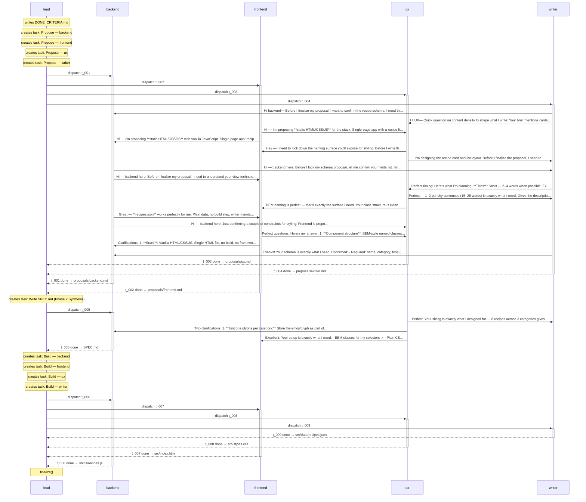
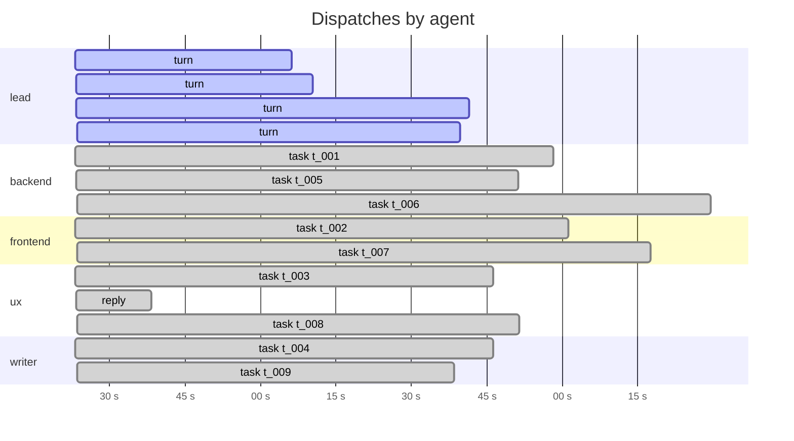
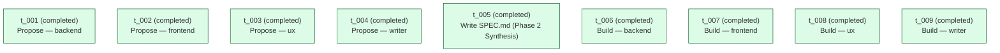

# Run `20260423_054538`

See also: [report.html](report.html)

| | |
|---|---|
| goal | Ship a recipes website. Take the vague brief through two rounds of team deliberation, produce a SPEC.md that pins every cross-team contract, then dispatch parallel build tasks with no further coordination. Verify the produced files form a working static site. |
| team | `recipes-website` |
| started | 2026-04-23T05:45:38.040271+00:00 |
| duration | 560.7 s |
| status | **finalized** |
| total cost | $2.0006 (14 turns) |
| tokens | in 791 / out 91416 / cache_r 2871960 |

## Conversation

_Time-ordered exchange between agents: task dispatches, messages, and completions. CC-to-lead traffic is implicit in the primary arrow._

## Timeline

_Tool-use tick marks are omitted in the markdown view — see [report.html](report.html) for the high-resolution timeline._

## Task graph

## Per-agent costs

| agent | turns | cost | input | output | cache_r | cache_w |
|---|---:|---:|---:|---:|---:|---:|
| `backend` | 3 | $0.5437 | 195 | 25184 | 837505 | 62147 |
| `frontend` | 2 | $0.3066 | 179 | 14780 | 702201 | 47999 |
| `lead` | 4 | $0.6740 | 176 | 27772 | 699561 | 74746 |
| `ux` | 3 | $0.2729 | 118 | 12897 | 297970 | 32057 |
| `writer` | 2 | $0.2034 | 123 | 10783 | 334723 | 34913 |
| **TOTAL** | 14 | **$2.0006** | 791 | 91416 | 2871960 | 251862 |

## Tool-use tally

| agent | Read | send_message | Glob | read_messages | Write | create_task | assign_task | update_task | other |
|---|---:|---:|---:|---:|---:|---:|---:|---:|---:|
| `lead` | 13 | 0 | 2 | 1 | 0 | 9 | 9 | 0 | 5 |
| `backend` | 15 | 4 | 6 | 5 | 4 | 0 | 0 | 3 | 0 |
| `frontend` | 13 | 4 | 4 | 3 | 4 | 0 | 0 | 2 | 0 |
| `ux` | 4 | 7 | 1 | 2 | 2 | 0 | 0 | 2 | 0 |
| `writer` | 7 | 4 | 1 | 3 | 2 | 0 | 0 | 2 | 0 |

## Artifacts

**briefs/**
- `briefs/backend.md` (1,586 B)
- `briefs/frontend.md` (1,610 B)
- `briefs/ux.md` (1,839 B)
- `briefs/writer.md` (1,852 B)
**proposals/**
- `proposals/backend.md` (4,923 B)
- `proposals/frontend.md` (4,909 B)
- `proposals/ux.md` (3,897 B)
- `proposals/writer.md` (3,376 B)
**root/**
- `DONE_CRITERIA.md` (4,754 B)
- `OUTPUT.md` (9,239 B)
- `project_context.md` (2,061 B)
- `SPEC.md` (19,009 B)
**src/**
- `src/data/recipes.json` (10,559 B)
- `src/index.html` (3,030 B)
- `src/js/main.js` (7,516 B)
- `src/js/recipes.js` (2,056 B)
- `src/styles.css` (10,565 B)

## Messages

| ts | from → to | content |
|---|---|---|
| 2026-04-23T05:46:55.897125+00:00 | `writer` → `backend` | Hi backend—  Before I finalize my proposal, I want to confirm the recipe schema. I need these REQUIRED fields per recipe:  - name (string) - category (string — will be one of: breakfast, main, dessert |
| 2026-04-23T05:46:55.897125+00:00 | `writer` → `lead` (cc → backend) | Hi backend—  Before I finalize my proposal, I want to confirm the recipe schema. I need these REQUIRED fields per recipe:  - name (string) - category (string — will be one of: breakfast, main, dessert |
| 2026-04-23T05:46:57.316204+00:00 | `writer` → `lead` (cc → ux) | Hi UX—  Quick question on content density to shape what I write: Your brief mentions cards should display title, time, category, and "a line or two of description."  I'm planning to write descriptions |
| 2026-04-23T05:46:57.316204+00:00 | `writer` → `ux` | Hi UX—  Quick question on content density to shape what I write: Your brief mentions cards should display title, time, category, and "a line or two of description."  I'm planning to write descriptions |
| 2026-04-23T05:47:00.326457+00:00 | `frontend` → `lead` (cc → ux) | Hi — I'm proposing **static HTML/CSS/JS** for the stack. Single-page app with a recipe list as a card grid, detail on click opens a modal.  For styling hooks, I'll use **BEM-style CSS classes**: - `.r |
| 2026-04-23T05:47:00.326457+00:00 | `frontend` → `ux` | Hi — I'm proposing **static HTML/CSS/JS** for the stack. Single-page app with a recipe list as a card grid, detail on click opens a modal.  For styling hooks, I'll use **BEM-style CSS classes**: - `.r |
| 2026-04-23T05:47:02.199672+00:00 | `frontend` → `backend` | Hi — I'm proposing **static HTML/CSS/JS** with vanilla JavaScript. Single-page app: recipe list on load, detail on click opens a modal.  For data delivery, I need the recipe data as a JSON structure.  |
| 2026-04-23T05:47:02.199672+00:00 | `frontend` → `lead` (cc → backend) | Hi — I'm proposing **static HTML/CSS/JS** with vanilla JavaScript. Single-page app: recipe list on load, detail on click opens a modal.  For data delivery, I need the recipe data as a JSON structure.  |
| 2026-04-23T05:47:09.914561+00:00 | `ux` → `frontend` | Hey — I need to lock down the naming surface you'll expose for styling. Before I write the UX proposal, tell me:  1. What's your component structure? Will you emit named classes (e.g., `.rx-recipe-car |
| 2026-04-23T05:47:09.914561+00:00 | `ux` → `lead` (cc → frontend) | Hey — I need to lock down the naming surface you'll expose for styling. Before I write the UX proposal, tell me:  1. What's your component structure? Will you emit named classes (e.g., `.rx-recipe-car |
| 2026-04-23T05:47:12.054616+00:00 | `ux` → `lead` (cc → writer) | I'm designing the recipe card and list layout. Before I finalize the proposal, I need to know your content density:  1. Recipe titles — short (e.g., "Pasta") or longer (e.g., "Creamy Tuscan Chicken Pa |
| 2026-04-23T05:47:12.054616+00:00 | `ux` → `writer` | I'm designing the recipe card and list layout. Before I finalize the proposal, I need to know your content density:  1. Recipe titles — short (e.g., "Pasta") or longer (e.g., "Creamy Tuscan Chicken Pa |
| 2026-04-23T05:47:13.934340+00:00 | `backend` → `lead` (cc → writer) | Hi — backend here. Before I lock my schema proposal, let me confirm your fields list.  I'm proposing a recipe object with: - name, category, time (minutes), servings, description, ingredients (as stri |
| 2026-04-23T05:47:13.934340+00:00 | `backend` → `writer` | Hi — backend here. Before I lock my schema proposal, let me confirm your fields list.  I'm proposing a recipe object with: - name, category, time (minutes), servings, description, ingredients (as stri |
| 2026-04-23T05:47:15.244435+00:00 | `backend` → `frontend` | Hi — backend here. Before I finalize my proposal, I need to understand your view technology.  What are you leaning toward? Vanilla HTML/JS, React, Vue, server-rendered, or something else?  Once I know |
| 2026-04-23T05:47:15.244435+00:00 | `backend` → `lead` (cc → frontend) | Hi — backend here. Before I finalize my proposal, I need to understand your view technology.  What are you leaning toward? Vanilla HTML/JS, React, Vue, server-rendered, or something else?  Once I know |
| 2026-04-23T05:47:18.424596+00:00 | `writer` → `lead` (cc → ux) | Perfect timing! Here's what I'm planning:  **Titles:** Short — 2–4 words when possible. Examples: "Fluffy Pancakes", "Tomato Soup", "Chocolate Cake". Makes for a crisp card.  **Descriptions:** 1–2 sen |
| 2026-04-23T05:47:18.424596+00:00 | `writer` → `ux` | Perfect timing! Here's what I'm planning:  **Titles:** Short — 2–4 words when possible. Examples: "Fluffy Pancakes", "Tomato Soup", "Chocolate Cake". Makes for a crisp card.  **Descriptions:** 1–2 sen |
| 2026-04-23T05:47:19.275886+00:00 | `ux` → `lead` (cc → writer) | Perfect — 1–2 punchy sentences (15–25 words) is exactly what I need. Gives the description breathing room in the card without making it text-heavy.  Going with unicode glyphs per category as decorativ |
| 2026-04-23T05:47:19.275886+00:00 | `ux` → `writer` | Perfect — 1–2 punchy sentences (15–25 words) is exactly what I need. Gives the description breathing room in the card without making it text-heavy.  Going with unicode glyphs per category as decorativ |
| 2026-04-23T05:47:20.776507+00:00 | `ux` → `frontend` | BEM naming is perfect — that's exactly the surface I need. Your class structure is clean.  Confirming my assumptions: I'll style `.recipe-list` as a responsive grid (2–3 columns on desktop, 1 column o |
| 2026-04-23T05:47:20.776507+00:00 | `ux` → `lead` (cc → frontend) | BEM naming is perfect — that's exactly the surface I need. Your class structure is clean.  Confirming my assumptions: I'll style `.recipe-list` as a responsive grid (2–3 columns on desktop, 1 column o |
| 2026-04-23T05:47:22.928437+00:00 | `backend` → `frontend` | Great — **recipes.json** works perfectly for me. Plain data, no build step, writer maintains it directly.  I'll structure it as a JSON array of recipe objects. You fetch it on page load and populate t |
| 2026-04-23T05:47:22.928437+00:00 | `backend` → `lead` (cc → frontend) | Great — **recipes.json** works perfectly for me. Plain data, no build step, writer maintains it directly.  I'll structure it as a JSON array of recipe objects. You fetch it on page load and populate t |
| 2026-04-23T05:47:24.640123+00:00 | `backend` → `lead` (cc → ux) | Hi — backend here. Just confirming a couple of constraints for styling:  Frontend is proposing vanilla HTML/CSS/JS with a card grid list view + modal detail. Categories: breakfast, main, dessert.  You |
| 2026-04-23T05:47:24.640123+00:00 | `backend` → `ux` | Hi — backend here. Just confirming a couple of constraints for styling:  Frontend is proposing vanilla HTML/CSS/JS with a card grid list view + modal detail. Categories: breakfast, main, dessert.  You |
| 2026-04-23T05:47:26.309764+00:00 | `frontend` → `lead` (cc → ux) | Perfect questions. Here's my answer:  1. **Component structure**: BEM-style named classes in plain HTML/CSS, no CSS-in-JS. I'll emit semantic class names like `.recipe-card`, `.recipe-card__title`, et |
| 2026-04-23T05:47:26.309764+00:00 | `frontend` → `ux` | Perfect questions. Here's my answer:  1. **Component structure**: BEM-style named classes in plain HTML/CSS, no CSS-in-JS. I'll emit semantic class names like `.recipe-card`, `.recipe-card__title`, et |
| 2026-04-23T05:47:28.339322+00:00 | `frontend` → `backend` | Clarifications:  1. **Stack**: Vanilla HTML/CSS/JS. Single HTML file, no build, no framework. I load recipe data on page load and render it with vanilla JS.  2. **Data delivery**: I need the recipes a |
| 2026-04-23T05:47:28.339322+00:00 | `frontend` → `lead` (cc → backend) | Clarifications:  1. **Stack**: Vanilla HTML/CSS/JS. Single HTML file, no build, no framework. I load recipe data on page load and render it with vanilla JS.  2. **Data delivery**: I need the recipes a |
| 2026-04-23T05:47:38.330692+00:00 | `writer` → `backend` | Thanks! Your schema is exactly what I need. Confirmed:  - Required: name, category, time (minutes), servings, description, ingredients (strings), steps ✓ - Optional: difficulty (easy\|medium\|hard), t |
| 2026-04-23T05:47:38.330692+00:00 | `writer` → `lead` (cc → backend) | Thanks! Your schema is exactly what I need. Confirmed:  - Required: name, category, time (minutes), servings, description, ingredients (strings), steps ✓ - Optional: difficulty (easy\|medium\|hard), t |
| 2026-04-23T05:48:59.377972+00:00 | `ux` → `lead` (cc → writer) | Perfect. Your sizing is exactly what I designed for — 8 recipes across 3 categories gives the grid room to breathe on desktop and flows cleanly to a single column on mobile. Short titles (2–4 words) + |
| 2026-04-23T05:48:59.377972+00:00 | `ux` → `writer` | Perfect. Your sizing is exactly what I designed for — 8 recipes across 3 categories gives the grid room to breathe on desktop and flows cleanly to a single column on mobile. Short titles (2–4 words) + |
| 2026-04-23T05:49:00.866566+00:00 | `ux` → `backend` | Two clarifications:  1. **Unicode glyphs per category:** Store the emoji/glyph as part of the category metadata in your schema (e.g., `{ "name": "Breakfast", "emoji": "🌅" }`). Frontend will render it  |
| 2026-04-23T05:49:00.866566+00:00 | `ux` → `lead` (cc → backend) | Two clarifications:  1. **Unicode glyphs per category:** Store the emoji/glyph as part of the category metadata in your schema (e.g., `{ "name": "Breakfast", "emoji": "🌅" }`). Frontend will render it  |
| 2026-04-23T05:49:01.672133+00:00 | `ux` → `frontend` | Excellent. Your setup is exactly what I need: - BEM classes for my selectors ✓ - Plain CSS with custom properties for palette tokens ✓ - I own visual styling (colors, type, spacing, layout, responsive |
| 2026-04-23T05:49:01.672133+00:00 | `ux` → `lead` (cc → frontend) | Excellent. Your setup is exactly what I need: - BEM classes for my selectors ✓ - Plain CSS with custom properties for palette tokens ✓ - I own visual styling (colors, type, spacing, layout, responsive |

## Event counts

| event | count |
|---|---:|
| `dispatch_end` | 9 |
| `dispatch_round` | 3 |
| `dispatch_start` | 9 |
| `lead_block` | 74 |
| `lead_prompt` | 4 |
| `lead_result` | 4 |
| `lead_turn_end` | 4 |
| `lead_turn_start` | 4 |
| `loop_exit` | 1 |
| `output_written` | 1 |
| `reply_dispatch_end` | 1 |
| `reply_dispatch_start` | 1 |
| `run_start` | 1 |
| `run_summary_written` | 1 |
| `teammate_block` | 252 |
| `teammate_prompt` | 10 |
| `teammate_result` | 10 |
| `tool_use` | 143 |
