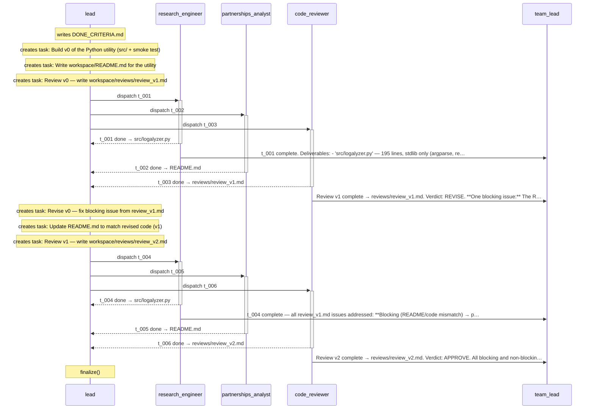
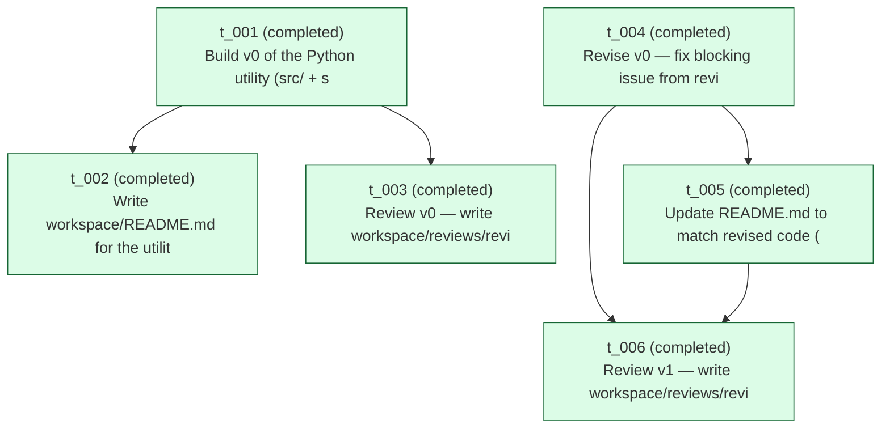

# Run `20260423_054936`

See also: [report.html](report.html)

| | |
|---|---|
| goal | Build a small Python utility as a team. Domain is open — pick anything useful in under 200 lines. Must include workspace/README.md and a smoke test that actually runs. Prefer the standard library. The utility should be offline-friendly (no network calls in normal operation). The reviewer will inspect every code artifact. |
| team | `shutdown-scenario` |
| started | 2026-04-23T05:49:36.254698+00:00 |
| duration | 1382.2 s |
| status | **finalized** |
| total cost | $5.8409 (12 turns) |
| tokens | in 133 / out 75553 / cache_r 3229795 |

## Conversation

_Time-ordered exchange between agents: task dispatches, messages, and completions. CC-to-lead traffic is implicit in the primary arrow._

## Timeline

_Tool-use tick marks are omitted in the markdown view — see [report.html](report.html) for the high-resolution timeline._

```mermaid
gantt
    title Dispatches by agent
    dateFormat X
    axisFormat %S s
    section lead
    turn :active, lead_0, 1776923378, 53s
    turn :active, lead_1, 1776923605, 25s
    turn :active, lead_2, 1776923824, 72s
    turn :active, lead_3, 1776924050, 24s
    turn :active, lead_4, 1776924474, 46s
    turn :active, lead_5, 1776924723, 34s
    section research_engineer
    task t_001 :done, research_engineer_0, 1776923431, 174s
    task t_004 :done, research_engineer_1, 1776923896, 154s
    section partnerships_analyst
    task t_002 :done, partnerships_analyst_0, 1776923630, 97s
    task t_005 :done, partnerships_analyst_1, 1776924074, 400s
    section code_reviewer
    task t_003 :done, code_reviewer_0, 1776923630, 194s
    task t_006 :done, code_reviewer_1, 1776924520, 203s
```

## Task graph

## Per-agent costs

| agent | turns | cost | input | output | cache_r | cache_w |
|---|---:|---:|---:|---:|---:|---:|
| `code_reviewer` | 2 | $1.0510 | 22 | 18131 | 465280 | 79115 |
| `lead` | 6 | $2.1988 | 41 | 10086 | 618432 | 72035 |
| `partnerships_analyst` | 2 | $1.0750 | 22 | 28545 | 561124 | 78920 |
| `research_engineer` | 2 | $1.5162 | 48 | 18791 | 1584959 | 58632 |
| **TOTAL** | 12 | **$5.8409** | 133 | 75553 | 3229795 | 288702 |

## Tool-use tally

| agent | Read | Edit | Glob | Bash | create_task | assign_task | update_task | Write | other |
|---|---:|---:|---:|---:|---:|---:|---:|---:|---:|
| `lead` | 8 | 0 | 3 | 0 | 6 | 6 | 0 | 0 | 3 |
| `research_engineer` | 9 | 16 | 1 | 11 | 0 | 0 | 2 | 2 | 4 |
| `partnerships_analyst` | 10 | 4 | 2 | 0 | 0 | 0 | 2 | 1 | 2 |
| `code_reviewer` | 13 | 0 | 6 | 0 | 0 | 0 | 2 | 2 | 6 |

## Artifacts

**reviews/**
- `reviews/review_v1.md` (2,544 B)
- `reviews/review_v2.md` (2,212 B)
**root/**
- `DONE_CRITERIA.md` (1,539 B)
- `OUTPUT.md` (2,439 B)
- `README.md` (5,220 B)
**src/**
- `src/__pycache__/logalyzer.cpython-312.pyc` (8,713 B)
- `src/logalyzer.py` (5,844 B)
- `src/test_smoke.py` (6,255 B)

## Messages

| ts | from → to | content |
|---|---|---|
| 2026-04-23T05:53:19.977705+00:00 | `research_engineer` → `team_lead` | t_001 complete. Deliverables:  - `src/logalyzer.py` — 195 lines, stdlib only (argparse, re, collections, pathlib). Log file analyser: counts lines by level (DEBUG/INFO/WARNING/ERROR/CRITICAL/UNKNOWN), |
| 2026-04-23T05:56:57.736243+00:00 | `code_reviewer` → `team_lead` | Review v1 complete → reviews/review_v1.md. Verdict: REVISE.  **One blocking issue:** The README's `--level ERROR --show-lines` example shows a summary containing only `ERROR 15 100.0%`, but the implem |
| 2026-04-23T06:00:42.441285+00:00 | `research_engineer` → `team_lead` | t_004 complete — all review_v1.md issues addressed:  **Blocking (README/code mismatch) → path (b):** - Corrected README.md `--level ERROR --show-lines` example (lines 88-107) to show the actual full-d |
| 2026-04-23T06:11:56.584213+00:00 | `code_reviewer` → `team_lead` | Review v2 complete → reviews/review_v2.md. Verdict: APPROVE.  All blocking and non-blocking issues from v1 were addressed: • README --level example corrected (shows full summary + prose explanation) ✅ |

## Event counts

| event | count |
|---|---:|
| `dispatch_end` | 6 |
| `dispatch_round` | 5 |
| `dispatch_start` | 6 |
| `lead_block` | 53 |
| `lead_prompt` | 6 |
| `lead_result` | 6 |
| `lead_turn_end` | 6 |
| `lead_turn_start` | 6 |
| `loop_exit` | 1 |
| `output_written` | 1 |
| `run_start` | 1 |
| `run_summary_written` | 1 |
| `teammate_block` | 171 |
| `teammate_prompt` | 6 |
| `teammate_result` | 6 |
| `tool_use` | 121 |
