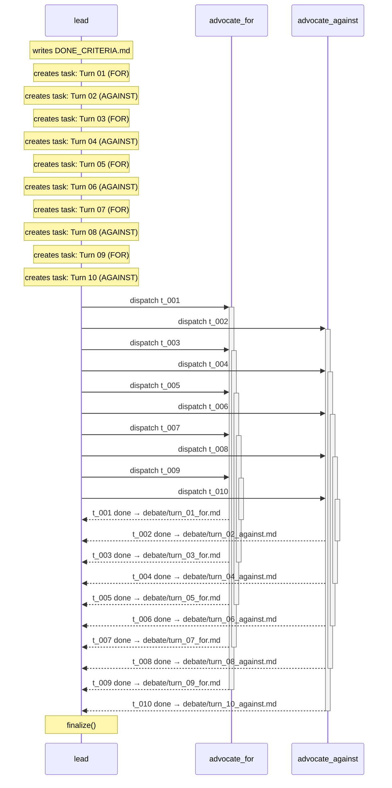
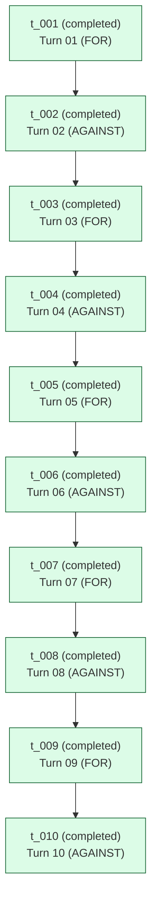

# Run `20260422_154916`

See also: [report.html](report.html)

| | |
|---|---|
| goal | Zero regulation on A.I. so we can get to ASI as soon as possible. |
| team | `steelman-debate` |
| started | 2026-04-22T15:49:16.326801+00:00 |
| duration | 359.9 s |
| status | **finalized** |
| total cost | $1.8022 (21 turns) |
| tokens | in 590 / out 29581 / cache_r 1410754 |

## Conversation

_Time-ordered exchange between agents: task dispatches, messages, and completions. CC-to-lead traffic is implicit in the primary arrow._

## Timeline

_Tool-use tick marks are omitted in the markdown view — see [report.html](report.html) for the high-resolution timeline._

```mermaid
gantt
    title Dispatches by agent
    dateFormat X
    axisFormat %S s
    section lead
    turn :active, lead_0, 1776872957, 36s
    turn :active, lead_1, 1776873010, 3s
    turn :active, lead_2, 1776873037, 2s
    turn :active, lead_3, 1776873061, 1s
    turn :active, lead_4, 1776873087, 1s
    turn :active, lead_5, 1776873110, 1s
    turn :active, lead_6, 1776873136, 20s
    turn :active, lead_7, 1776873177, 1s
    turn :active, lead_8, 1776873202, 15s
    turn :active, lead_9, 1776873239, 3s
    turn :active, lead_10, 1776873267, 48s
    section advocate_for
    task t_001 :done, advocate_for_0, 1776872993, 17s
    task t_003 :done, advocate_for_1, 1776873039, 22s
    task t_005 :done, advocate_for_2, 1776873088, 22s
    task t_007 :done, advocate_for_3, 1776873156, 21s
    task t_009 :done, advocate_for_4, 1776873217, 22s
    section advocate_against
    task t_002 :done, advocate_against_0, 1776873013, 24s
    task t_004 :done, advocate_against_1, 1776873062, 25s
    task t_006 :done, advocate_against_2, 1776873111, 25s
    task t_008 :done, advocate_against_3, 1776873178, 24s
    task t_010 :done, advocate_against_4, 1776873242, 25s
```

## Task graph

## Per-agent costs

| agent | turns | cost | input | output | cache_r | cache_w |
|---|---:|---:|---:|---:|---:|---:|
| `advocate_against` | 5 | $0.3342 | 164 | 9615 | 411595 | 16884 |
| `advocate_for` | 5 | $0.3538 | 164 | 8033 | 381903 | 24252 |
| `lead` | 11 | $1.1142 | 262 | 11933 | 617256 | 36361 |
| **TOTAL** | 21 | **$1.8022** | 590 | 29581 | 1410754 | 77497 |

## Tool-use tally

| agent | Read | create_task | assign_task | Write | update_task | Glob | write_scratchpad | list_tasks | other |
|---|---:|---:|---:|---:|---:|---:|---:|---:|---:|
| `lead` | 22 | 10 | 10 | 0 | 0 | 1 | 1 | 1 | 1 |
| `advocate_for` | 6 | 0 | 0 | 5 | 5 | 1 | 0 | 0 | 0 |
| `advocate_against` | 8 | 0 | 0 | 5 | 5 | 1 | 0 | 0 | 0 |

## Artifacts

**debate/**
- `debate/turn_01_for.md` (709 B)
- `debate/turn_02_against.md` (789 B)
- `debate/turn_03_for.md` (894 B)
- `debate/turn_04_against.md` (911 B)
- `debate/turn_05_for.md` (883 B)
- `debate/turn_06_against.md` (900 B)
- `debate/turn_07_for.md` (892 B)
- `debate/turn_08_against.md` (973 B)
- `debate/turn_09_for.md` (890 B)
- `debate/turn_10_against.md` (966 B)
**root/**
- `CHAT_HISTORY.md` (9,066 B)
- `DONE_CRITERIA.md` (1,114 B)
- `OUTPUT.md` (5,694 B)

## Messages

_No messages exchanged in this run._

## Event counts

| event | count |
|---|---:|
| `dispatch_end` | 10 |
| `dispatch_round` | 10 |
| `dispatch_start` | 10 |
| `lead_block` | 96 |
| `lead_prompt` | 11 |
| `lead_result` | 11 |
| `lead_turn_end` | 11 |
| `lead_turn_start` | 11 |
| `loop_exit` | 1 |
| `output_written` | 1 |
| `reports_written` | 1 |
| `run_end` | 1 |
| `run_start` | 1 |
| `run_summary_written` | 1 |
| `teammate_block` | 95 |
| `teammate_prompt` | 10 |
| `teammate_result` | 10 |
| `tool_use` | 82 |
